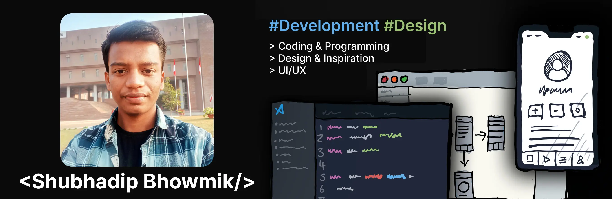

## I'm Shubhadip Bhowmik — Hobbyist Developer & Tinkerer 👨‍💻

  
  
  
  
  

### Glad to see you here!

I am a passionate web developer working on various projects, including SEO tools, educational platforms, and interactive websites. Currently, I'm diving deep into React, Node.js, and MongoDB to build scalable applications.

### Talking about Personal Stuffs:

- 🛠 &nbsp; I'm currently developing with JavaScript, React, and Node.js.
- 🚀 &nbsp; I’m working on an all-in-one marketplace for university students (CampusCorner).
- 💬 &nbsp; I write blogs [here](https://shubhadipbhowmik.vercel.app/blog/?ref=github-profile-readme)!
- 📰 &nbsp; Stay tuned for updates on new tools and tips on my blog.
- 👾 &nbsp; Fun fact: I enjoy building things that help others in their day-to-day tasks.
- 📫 &nbsp; How to reach me: shubhadipbhowmikdev@gmail.com

### My Absolute Favorites:

- 💻 &nbsp; I love working with modern web technologies and building scalable web applications.
- 📰 &nbsp; Writing technical blogs and sharing knowledge with others.
- 🎧 &nbsp; I enjoy listening to music while coding—check out my [radio station](https://freecodecampradio.com).

### Languages and Tools:

<code></code>
<code></code>
<code></code>
<code></code>
<code></code>
<code></code>

### Projects and Dev Stuffs:

	
  
<b>⚡ Github Stats</b>

  
  

  
<b>🧑‍🚀 Open Source Projects</b>

   

| 💻 Projects                                                                             | 🌟 Stars                                                                                                                           | 🍴 Forks                                                                                                                           | 🐛 Issues                                                                                                          | 🔔 Pull Requests                                                                                                             | 👨‍💻 Language                                                                                                                 |
| --------------------------------------------------------------------------------------- | ---------------------------------------------------------------------------------------------------------------------------------- | ---------------------------------------------------------------------------------------------------------------------------------- | ------------------------------------------------------------------------------------------------------------------ | ---------------------------------------------------------------------------------------------------------------------------- | --------------------------------------------------------------------------------------------------------------------------- |
| [🔧 OptiSEO](https://github.com/subhadipbhowmik/optiseo)                                |                           |                           |                           |                           |                           |
| [📍 Campus Corner](https://github.com/subhadipbhowmik/campus-corner)                    |                     |                     |                     |                     |                     |
| [🧬 BioBranch](https://github.com/subhadipbhowmik/bio-branch)                           |                        |                        |                        |                        |                        |
| [💻 30 Days of C++](https://github.com/subhadipbhowmik/30-Days-Of-CPP)                  |                    |                    |                    |                    |                    |
| [📑 Contento](https://github.com/subhadipbhowmik/contento)                              |                          |                          |                          |                          |                          |
| [🎓 CU Calculator](https://github.com/subhadipbhowmik/chandigarh-university-calculator) |  |  |  |  |  |

  
<b>📝 Blog Posts</b>

  <!-- BLOG-POST-LIST:START -->
- [Top Best Online Radio Stations for Programmers](https://shubhadipbhowmik.vercel.app/blog/top-best-online-radio-station-for-programmers/)
 - [5 Strategies to Learn Better and Faster as a Software Engineer](https://shubhadipbhowmik.vercel.app/blog/5-strategies-to-learn-better-and-faster-as-a-software-engineer/)
 - [How to Integrate Cal.com in Next.js: A Complete Guide](https://shubhadipbhowmik.vercel.app/blog/how-to-integrate-cal-com-in-nextjs-complete-guide/)
 - [20 Tricky Truthy and Falsy Values in JavaScript with Solutions](https://shubhadipbhowmik.vercel.app/blog/20-tricky-javascript-truthy-and-falsy-values-with-solutions-for-beginners-and-advanced-developers/)
 - [21 Lessons I Learned at 21: Reflections on Growth and Self-Discovery](https://shubhadipbhowmik.vercel.app/blog/21-lessons-at-21-self-discovery-shubhadip-bhowmik/)
 - [PhonePe Payment Gateway Integration using React, Node, Express](https://shubhadipbhowmik.vercel.app/blog/phonepe-payment-gateway-integration-using-node-js-and-express-js/)
 - [My Experience at the Dussehra Mela in Chandigarh](https://shubhadipbhowmik.vercel.app/blog/my-dusshera-experience-in-chandigarh/)
 - [A Thoughtful and Heartfelt Letter to God Filled with Gratitude](https://shubhadipbhowmik.vercel.app/blog/letter-to-god/)

- [Top Best Online Radio Stations for Programmers](https://shubhadipbhowmik.vercel.app/blog/top-best-online-radio-station-for-programmers/)
 - [5 Strategies to Learn Better and Faster as a Software Engineer](https://shubhadipbhowmik.vercel.app/blog/5-strategies-to-learn-better-and-faster-as-a-software-engineer/)
 - [How to Integrate Cal.com in Next.js: A Complete Guide](https://shubhadipbhowmik.vercel.app/blog/how-to-integrate-cal-com-in-nextjs-complete-guide/)
 - [20 Tricky Truthy and Falsy Values in JavaScript with Solutions](https://shubhadipbhowmik.vercel.app/blog/20-tricky-javascript-truthy-and-falsy-values-with-solutions-for-beginners-and-advanced-developers/)
 - [21 Lessons I Learned at 21: Reflections on Growth and Self-Discovery](https://shubhadipbhowmik.vercel.app/blog/21-lessons-at-21-self-discovery-shubhadip-bhowmik/)
 - [PhonePe Payment Gateway Integration using React, Node, Express](https://shubhadipbhowmik.vercel.app/blog/phonepe-payment-gateway-integration-using-node-js-and-express-js/)
 - [My Experience at the Dussehra Mela in Chandigarh](https://shubhadipbhowmik.vercel.app/blog/my-dusshera-experience-in-chandigarh/)
 - [A Thoughtful and Heartfelt Letter to God Filled with Gratitude](https://shubhadipbhowmik.vercel.app/blog/letter-to-god/)

- [Top Best Online Radio Stations for Programmers](https://shubhadipbhowmik.vercel.app/blog/top-best-online-radio-station-for-programmers/)
 - [5 Strategies to Learn Better and Faster as a Software Engineer](https://shubhadipbhowmik.vercel.app/blog/5-strategies-to-learn-better-and-faster-as-a-software-engineer/)
 - [How to Integrate Cal.com in Next.js: A Complete Guide](https://shubhadipbhowmik.vercel.app/blog/how-to-integrate-cal-com-in-nextjs-complete-guide/)
 - [20 Tricky Truthy and Falsy Values in JavaScript with Solutions](https://shubhadipbhowmik.vercel.app/blog/20-tricky-javascript-truthy-and-falsy-values-with-solutions-for-beginners-and-advanced-developers/)
 - [21 Lessons I Learned at 21: Reflections on Growth and Self-Discovery](https://shubhadipbhowmik.vercel.app/blog/21-lessons-at-21-self-discovery-shubhadip-bhowmik/)
 - [PhonePe Payment Gateway Integration using React, Node, Express](https://shubhadipbhowmik.vercel.app/blog/phonepe-payment-gateway-integration-using-node-js-and-express-js/)
 - [My Experience at the Dussehra Mela in Chandigarh](https://shubhadipbhowmik.vercel.app/blog/my-dusshera-experience-in-chandigarh/)
 - [A Thoughtful and Heartfelt Letter to God Filled with Gratitude](https://shubhadipbhowmik.vercel.app/blog/letter-to-god/)

- [Top Best Online Radio Stations for Programmers](https://shubhadipbhowmik.vercel.app/blog/top-best-online-radio-station-for-programmers/)
 - [5 Strategies to Learn Better and Faster as a Software Engineer](https://shubhadipbhowmik.vercel.app/blog/5-strategies-to-learn-better-and-faster-as-a-software-engineer/)
 - [How to Integrate Cal.com in Next.js: A Complete Guide](https://shubhadipbhowmik.vercel.app/blog/how-to-integrate-cal-com-in-nextjs-complete-guide/)
 - [20 Tricky Truthy and Falsy Values in JavaScript with Solutions](https://shubhadipbhowmik.vercel.app/blog/20-tricky-javascript-truthy-and-falsy-values-with-solutions-for-beginners-and-advanced-developers/)
 - [21 Lessons I Learned at 21: Reflections on Growth and Self-Discovery](https://shubhadipbhowmik.vercel.app/blog/21-lessons-at-21-self-discovery-shubhadip-bhowmik/)
 - [PhonePe Payment Gateway Integration using React, Node, Express](https://shubhadipbhowmik.vercel.app/blog/phonepe-payment-gateway-integration-using-node-js-and-express-js/)
 - [My Experience at the Dussehra Mela in Chandigarh](https://shubhadipbhowmik.vercel.app/blog/my-dusshera-experience-in-chandigarh/)
 - [A Thoughtful and Heartfelt Letter to God Filled with Gratitude](https://shubhadipbhowmik.vercel.app/blog/letter-to-god/)

- [Top Best Online Radio Stations for Programmers](https://shubhadipbhowmik.vercel.app/blog/top-best-online-radio-station-for-programmers/)
 - [5 Strategies to Learn Better and Faster as a Software Engineer](https://shubhadipbhowmik.vercel.app/blog/5-strategies-to-learn-better-and-faster-as-a-software-engineer/)
 - [How to Integrate Cal.com in Next.js: A Complete Guide](https://shubhadipbhowmik.vercel.app/blog/how-to-integrate-cal-com-in-nextjs-complete-guide/)
 - [20 Tricky Truthy and Falsy Values in JavaScript with Solutions](https://shubhadipbhowmik.vercel.app/blog/20-tricky-javascript-truthy-and-falsy-values-with-solutions-for-beginners-and-advanced-developers/)
 - [21 Lessons I Learned at 21: Reflections on Growth and Self-Discovery](https://shubhadipbhowmik.vercel.app/blog/21-lessons-at-21-self-discovery-shubhadip-bhowmik/)
 - [PhonePe Payment Gateway Integration using React, Node, Express](https://shubhadipbhowmik.vercel.app/blog/phonepe-payment-gateway-integration-using-node-js-and-express-js/)
 - [My Experience at the Dussehra Mela in Chandigarh](https://shubhadipbhowmik.vercel.app/blog/my-dusshera-experience-in-chandigarh/)
 - [A Thoughtful and Heartfelt Letter to God Filled with Gratitude](https://shubhadipbhowmik.vercel.app/blog/letter-to-god/)

- [Top Best Online Radio Stations for Programmers](https://shubhadipbhowmik.vercel.app/blog/top-best-online-radio-station-for-programmers/)
 - [5 Strategies to Learn Better and Faster as a Software Engineer](https://shubhadipbhowmik.vercel.app/blog/5-strategies-to-learn-better-and-faster-as-a-software-engineer/)
 - [How to Integrate Cal.com in Next.js: A Complete Guide](https://shubhadipbhowmik.vercel.app/blog/how-to-integrate-cal-com-in-nextjs-complete-guide/)
 - [20 Tricky Truthy and Falsy Values in JavaScript with Solutions](https://shubhadipbhowmik.vercel.app/blog/20-tricky-javascript-truthy-and-falsy-values-with-solutions-for-beginners-and-advanced-developers/)
 - [21 Lessons I Learned at 21: Reflections on Growth and Self-Discovery](https://shubhadipbhowmik.vercel.app/blog/21-lessons-at-21-self-discovery-shubhadip-bhowmik/)
 - [PhonePe Payment Gateway Integration using React, Node, Express](https://shubhadipbhowmik.vercel.app/blog/phonepe-payment-gateway-integration-using-node-js-and-express-js/)
 - [My Experience at the Dussehra Mela in Chandigarh](https://shubhadipbhowmik.vercel.app/blog/my-dusshera-experience-in-chandigarh/)
 - [A Thoughtful and Heartfelt Letter to God Filled with Gratitude](https://shubhadipbhowmik.vercel.app/blog/letter-to-god/)

- [Top Best Online Radio Stations for Programmers](https://shubhadipbhowmik.vercel.app/blog/top-best-online-radio-station-for-programmers/)
 - [5 Strategies to Learn Better and Faster as a Software Engineer](https://shubhadipbhowmik.vercel.app/blog/5-strategies-to-learn-better-and-faster-as-a-software-engineer/)
 - [How to Integrate Cal.com in Next.js: A Complete Guide](https://shubhadipbhowmik.vercel.app/blog/how-to-integrate-cal-com-in-nextjs-complete-guide/)
 - [20 Tricky Truthy and Falsy Values in JavaScript with Solutions](https://shubhadipbhowmik.vercel.app/blog/20-tricky-javascript-truthy-and-falsy-values-with-solutions-for-beginners-and-advanced-developers/)
 - [21 Lessons I Learned at 21: Reflections on Growth and Self-Discovery](https://shubhadipbhowmik.vercel.app/blog/21-lessons-at-21-self-discovery-shubhadip-bhowmik/)
 - [PhonePe Payment Gateway Integration using React, Node, Express](https://shubhadipbhowmik.vercel.app/blog/phonepe-payment-gateway-integration-using-node-js-and-express-js/)
 - [My Experience at the Dussehra Mela in Chandigarh](https://shubhadipbhowmik.vercel.app/blog/my-dusshera-experience-in-chandigarh/)
 - [A Thoughtful and Heartfelt Letter to God Filled with Gratitude](https://shubhadipbhowmik.vercel.app/blog/letter-to-god/)

- [Top Best Online Radio Stations for Programmers](https://shubhadipbhowmik.vercel.app/blog/top-best-online-radio-station-for-programmers/)
 - [5 Strategies to Learn Better and Faster as a Software Engineer](https://shubhadipbhowmik.vercel.app/blog/5-strategies-to-learn-better-and-faster-as-a-software-engineer/)
 - [How to Integrate Cal.com in Next.js: A Complete Guide](https://shubhadipbhowmik.vercel.app/blog/how-to-integrate-cal-com-in-nextjs-complete-guide/)
 - [20 Tricky Truthy and Falsy Values in JavaScript with Solutions](https://shubhadipbhowmik.vercel.app/blog/20-tricky-javascript-truthy-and-falsy-values-with-solutions-for-beginners-and-advanced-developers/)
 - [21 Lessons I Learned at 21: Reflections on Growth and Self-Discovery](https://shubhadipbhowmik.vercel.app/blog/21-lessons-at-21-self-discovery-shubhadip-bhowmik/)
 - [PhonePe Payment Gateway Integration using React, Node, Express](https://shubhadipbhowmik.vercel.app/blog/phonepe-payment-gateway-integration-using-node-js-and-express-js/)
 - [My Experience at the Dussehra Mela in Chandigarh](https://shubhadipbhowmik.vercel.app/blog/my-dusshera-experience-in-chandigarh/)
 - [A Thoughtful and Heartfelt Letter to God Filled with Gratitude](https://shubhadipbhowmik.vercel.app/blog/letter-to-god/)

- [Top Best Online Radio Stations for Programmers](https://shubhadipbhowmik.vercel.app/blog/top-best-online-radio-station-for-programmers/)
 - [5 Strategies to Learn Better and Faster as a Software Engineer](https://shubhadipbhowmik.vercel.app/blog/5-strategies-to-learn-better-and-faster-as-a-software-engineer/)
 - [How to Integrate Cal.com in Next.js: A Complete Guide](https://shubhadipbhowmik.vercel.app/blog/how-to-integrate-cal-com-in-nextjs-complete-guide/)
 - [20 Tricky Truthy and Falsy Values in JavaScript with Solutions](https://shubhadipbhowmik.vercel.app/blog/20-tricky-javascript-truthy-and-falsy-values-with-solutions-for-beginners-and-advanced-developers/)
 - [21 Lessons I Learned at 21: Reflections on Growth and Self-Discovery](https://shubhadipbhowmik.vercel.app/blog/21-lessons-at-21-self-discovery-shubhadip-bhowmik/)
 - [PhonePe Payment Gateway Integration using React, Node, Express](https://shubhadipbhowmik.vercel.app/blog/phonepe-payment-gateway-integration-using-node-js-and-express-js/)
 - [My Experience at the Dussehra Mela in Chandigarh](https://shubhadipbhowmik.vercel.app/blog/my-dusshera-experience-in-chandigarh/)
 - [A Thoughtful and Heartfelt Letter to God Filled with Gratitude](https://shubhadipbhowmik.vercel.app/blog/letter-to-god/)

- [Top Best Online Radio Stations for Programmers](https://shubhadipbhowmik.vercel.app/blog/top-best-online-radio-station-for-programmers/)
 - [5 Strategies to Learn Better and Faster as a Software Engineer](https://shubhadipbhowmik.vercel.app/blog/5-strategies-to-learn-better-and-faster-as-a-software-engineer/)
 - [How to Integrate Cal.com in Next.js: A Complete Guide](https://shubhadipbhowmik.vercel.app/blog/how-to-integrate-cal-com-in-nextjs-complete-guide/)
 - [20 Tricky Truthy and Falsy Values in JavaScript with Solutions](https://shubhadipbhowmik.vercel.app/blog/20-tricky-javascript-truthy-and-falsy-values-with-solutions-for-beginners-and-advanced-developers/)
 - [21 Lessons I Learned at 21: Reflections on Growth and Self-Discovery](https://shubhadipbhowmik.vercel.app/blog/21-lessons-at-21-self-discovery-shubhadip-bhowmik/)
 - [PhonePe Payment Gateway Integration using React, Node, Express](https://shubhadipbhowmik.vercel.app/blog/phonepe-payment-gateway-integration-using-node-js-and-express-js/)
 - [My Experience at the Dussehra Mela in Chandigarh](https://shubhadipbhowmik.vercel.app/blog/my-dusshera-experience-in-chandigarh/)
 - [A Thoughtful and Heartfelt Letter to God Filled with Gratitude](https://shubhadipbhowmik.vercel.app/blog/letter-to-god/)

- [Top Best Online Radio Stations for Programmers](https://shubhadipbhowmik.vercel.app/blog/top-best-online-radio-station-for-programmers/)
 - [5 Strategies to Learn Better and Faster as a Software Engineer](https://shubhadipbhowmik.vercel.app/blog/5-strategies-to-learn-better-and-faster-as-a-software-engineer/)
 - [How to Integrate Cal.com in Next.js: A Complete Guide](https://shubhadipbhowmik.vercel.app/blog/how-to-integrate-cal-com-in-nextjs-complete-guide/)
 - [20 Tricky Truthy and Falsy Values in JavaScript with Solutions](https://shubhadipbhowmik.vercel.app/blog/20-tricky-javascript-truthy-and-falsy-values-with-solutions-for-beginners-and-advanced-developers/)
 - [21 Lessons I Learned at 21: Reflections on Growth and Self-Discovery](https://shubhadipbhowmik.vercel.app/blog/21-lessons-at-21-self-discovery-shubhadip-bhowmik/)
 - [PhonePe Payment Gateway Integration using React, Node, Express](https://shubhadipbhowmik.vercel.app/blog/phonepe-payment-gateway-integration-using-node-js-and-express-js/)
 - [My Experience at the Dussehra Mela in Chandigarh](https://shubhadipbhowmik.vercel.app/blog/my-dusshera-experience-in-chandigarh/)
 - [A Thoughtful and Heartfelt Letter to God Filled with Gratitude](https://shubhadipbhowmik.vercel.app/blog/letter-to-god/)

- [Top Best Online Radio Stations for Programmers](https://shubhadipbhowmik.vercel.app/blog/top-best-online-radio-station-for-programmers/)
 - [5 Strategies to Learn Better and Faster as a Software Engineer](https://shubhadipbhowmik.vercel.app/blog/5-strategies-to-learn-better-and-faster-as-a-software-engineer/)
 - [How to Integrate Cal.com in Next.js: A Complete Guide](https://shubhadipbhowmik.vercel.app/blog/how-to-integrate-cal-com-in-nextjs-complete-guide/)
 - [20 Tricky Truthy and Falsy Values in JavaScript with Solutions](https://shubhadipbhowmik.vercel.app/blog/20-tricky-javascript-truthy-and-falsy-values-with-solutions-for-beginners-and-advanced-developers/)
 - [21 Lessons I Learned at 21: Reflections on Growth and Self-Discovery](https://shubhadipbhowmik.vercel.app/blog/21-lessons-at-21-self-discovery-shubhadip-bhowmik/)
 - [PhonePe Payment Gateway Integration using React, Node, Express](https://shubhadipbhowmik.vercel.app/blog/phonepe-payment-gateway-integration-using-node-js-and-express-js/)
 - [My Experience at the Dussehra Mela in Chandigarh](https://shubhadipbhowmik.vercel.app/blog/my-dusshera-experience-in-chandigarh/)
 - [A Thoughtful and Heartfelt Letter to God Filled with Gratitude](https://shubhadipbhowmik.vercel.app/blog/letter-to-god/)

- [Top Best Online Radio Stations for Programmers](https://shubhadipbhowmik.vercel.app/blog/top-best-online-radio-station-for-programmers/)
 - [5 Strategies to Learn Better and Faster as a Software Engineer](https://shubhadipbhowmik.vercel.app/blog/5-strategies-to-learn-better-and-faster-as-a-software-engineer/)
 - [How to Integrate Cal.com in Next.js: A Complete Guide](https://shubhadipbhowmik.vercel.app/blog/how-to-integrate-cal-com-in-nextjs-complete-guide/)
 - [20 Tricky Truthy and Falsy Values in JavaScript with Solutions](https://shubhadipbhowmik.vercel.app/blog/20-tricky-javascript-truthy-and-falsy-values-with-solutions-for-beginners-and-advanced-developers/)
 - [21 Lessons I Learned at 21: Reflections on Growth and Self-Discovery](https://shubhadipbhowmik.vercel.app/blog/21-lessons-at-21-self-discovery-shubhadip-bhowmik/)
 - [PhonePe Payment Gateway Integration using React, Node, Express](https://shubhadipbhowmik.vercel.app/blog/phonepe-payment-gateway-integration-using-node-js-and-express-js/)
 - [My Experience at the Dussehra Mela in Chandigarh](https://shubhadipbhowmik.vercel.app/blog/my-dusshera-experience-in-chandigarh/)
 - [A Thoughtful and Heartfelt Letter to God Filled with Gratitude](https://shubhadipbhowmik.vercel.app/blog/letter-to-god/)

- [Top Best Online Radio Stations for Programmers](https://shubhadipbhowmik.vercel.app/blog/top-best-online-radio-station-for-programmers/)
 - [5 Strategies to Learn Better and Faster as a Software Engineer](https://shubhadipbhowmik.vercel.app/blog/5-strategies-to-learn-better-and-faster-as-a-software-engineer/)
 - [How to Integrate Cal.com in Next.js: A Complete Guide](https://shubhadipbhowmik.vercel.app/blog/how-to-integrate-cal-com-in-nextjs-complete-guide/)
 - [20 Tricky Truthy and Falsy Values in JavaScript with Solutions](https://shubhadipbhowmik.vercel.app/blog/20-tricky-javascript-truthy-and-falsy-values-with-solutions-for-beginners-and-advanced-developers/)
 - [21 Lessons I Learned at 21: Reflections on Growth and Self-Discovery](https://shubhadipbhowmik.vercel.app/blog/21-lessons-at-21-self-discovery-shubhadip-bhowmik/)
 - [PhonePe Payment Gateway Integration using React, Node, Express](https://shubhadipbhowmik.vercel.app/blog/phonepe-payment-gateway-integration-using-node-js-and-express-js/)
 - [My Experience at the Dussehra Mela in Chandigarh](https://shubhadipbhowmik.vercel.app/blog/my-dusshera-experience-in-chandigarh/)
 - [A Thoughtful and Heartfelt Letter to God Filled with Gratitude](https://shubhadipbhowmik.vercel.app/blog/letter-to-god/)

- [Top Best Online Radio Stations for Programmers](https://shubhadipbhowmik.vercel.app/blog/top-best-online-radio-station-for-programmers/)
 - [5 Strategies to Learn Better and Faster as a Software Engineer](https://shubhadipbhowmik.vercel.app/blog/5-strategies-to-learn-better-and-faster-as-a-software-engineer/)
 - [How to Integrate Cal.com in Next.js: A Complete Guide](https://shubhadipbhowmik.vercel.app/blog/how-to-integrate-cal-com-in-nextjs-complete-guide/)
 - [20 Tricky Truthy and Falsy Values in JavaScript with Solutions](https://shubhadipbhowmik.vercel.app/blog/20-tricky-javascript-truthy-and-falsy-values-with-solutions-for-beginners-and-advanced-developers/)
 - [21 Lessons I Learned at 21: Reflections on Growth and Self-Discovery](https://shubhadipbhowmik.vercel.app/blog/21-lessons-at-21-self-discovery-shubhadip-bhowmik/)
 - [PhonePe Payment Gateway Integration using React, Node, Express](https://shubhadipbhowmik.vercel.app/blog/phonepe-payment-gateway-integration-using-node-js-and-express-js/)
 - [My Experience at the Dussehra Mela in Chandigarh](https://shubhadipbhowmik.vercel.app/blog/my-dusshera-experience-in-chandigarh/)
 - [A Thoughtful and Heartfelt Letter to God Filled with Gratitude](https://shubhadipbhowmik.vercel.app/blog/letter-to-god/)

- [Top Best Online Radio Stations for Programmers](https://shubhadipbhowmik.vercel.app/blog/top-best-online-radio-station-for-programmers/)
 - [5 Strategies to Learn Better and Faster as a Software Engineer](https://shubhadipbhowmik.vercel.app/blog/5-strategies-to-learn-better-and-faster-as-a-software-engineer/)
 - [How to Integrate Cal.com in Next.js: A Complete Guide](https://shubhadipbhowmik.vercel.app/blog/how-to-integrate-cal-com-in-nextjs-complete-guide/)
 - [20 Tricky Truthy and Falsy Values in JavaScript with Solutions](https://shubhadipbhowmik.vercel.app/blog/20-tricky-javascript-truthy-and-falsy-values-with-solutions-for-beginners-and-advanced-developers/)
 - [21 Lessons I Learned at 21: Reflections on Growth and Self-Discovery](https://shubhadipbhowmik.vercel.app/blog/21-lessons-at-21-self-discovery-shubhadip-bhowmik/)
 - [PhonePe Payment Gateway Integration using React, Node, Express](https://shubhadipbhowmik.vercel.app/blog/phonepe-payment-gateway-integration-using-node-js-and-express-js/)
 - [My Experience at the Dussehra Mela in Chandigarh](https://shubhadipbhowmik.vercel.app/blog/my-dusshera-experience-in-chandigarh/)
 - [A Thoughtful and Heartfelt Letter to God Filled with Gratitude](https://shubhadipbhowmik.vercel.app/blog/letter-to-god/)

- [Top Best Online Radio Stations for Programmers](https://shubhadipbhowmik.vercel.app/blog/top-best-online-radio-station-for-programmers/)
 - [5 Strategies to Learn Better and Faster as a Software Engineer](https://shubhadipbhowmik.vercel.app/blog/5-strategies-to-learn-better-and-faster-as-a-software-engineer/)
 - [How to Integrate Cal.com in Next.js: A Complete Guide](https://shubhadipbhowmik.vercel.app/blog/how-to-integrate-cal-com-in-nextjs-complete-guide/)
 - [20 Tricky Truthy and Falsy Values in JavaScript with Solutions](https://shubhadipbhowmik.vercel.app/blog/20-tricky-javascript-truthy-and-falsy-values-with-solutions-for-beginners-and-advanced-developers/)
 - [21 Lessons I Learned at 21: Reflections on Growth and Self-Discovery](https://shubhadipbhowmik.vercel.app/blog/21-lessons-at-21-self-discovery-shubhadip-bhowmik/)
 - [PhonePe Payment Gateway Integration using React, Node, Express](https://shubhadipbhowmik.vercel.app/blog/phonepe-payment-gateway-integration-using-node-js-and-express-js/)
 - [My Experience at the Dussehra Mela in Chandigarh](https://shubhadipbhowmik.vercel.app/blog/my-dusshera-experience-in-chandigarh/)
 - [A Thoughtful and Heartfelt Letter to God Filled with Gratitude](https://shubhadipbhowmik.vercel.app/blog/letter-to-god/)

- [Top Best Online Radio Stations for Programmers](https://shubhadipbhowmik.vercel.app/blog/top-best-online-radio-station-for-programmers/)
 - [5 Strategies to Learn Better and Faster as a Software Engineer](https://shubhadipbhowmik.vercel.app/blog/5-strategies-to-learn-better-and-faster-as-a-software-engineer/)
 - [How to Integrate Cal.com in Next.js: A Complete Guide](https://shubhadipbhowmik.vercel.app/blog/how-to-integrate-cal-com-in-nextjs-complete-guide/)
 - [20 Tricky Truthy and Falsy Values in JavaScript with Solutions](https://shubhadipbhowmik.vercel.app/blog/20-tricky-javascript-truthy-and-falsy-values-with-solutions-for-beginners-and-advanced-developers/)
 - [21 Lessons I Learned at 21: Reflections on Growth and Self-Discovery](https://shubhadipbhowmik.vercel.app/blog/21-lessons-at-21-self-discovery-shubhadip-bhowmik/)
 - [PhonePe Payment Gateway Integration using React, Node, Express](https://shubhadipbhowmik.vercel.app/blog/phonepe-payment-gateway-integration-using-node-js-and-express-js/)
 - [My Experience at the Dussehra Mela in Chandigarh](https://shubhadipbhowmik.vercel.app/blog/my-dusshera-experience-in-chandigarh/)
 - [A Thoughtful and Heartfelt Letter to God Filled with Gratitude](https://shubhadipbhowmik.vercel.app/blog/letter-to-god/)

- [Top Best Online Radio Stations for Programmers](https://shubhadipbhowmik.vercel.app/blog/top-best-online-radio-station-for-programmers/)
 - [5 Strategies to Learn Better and Faster as a Software Engineer](https://shubhadipbhowmik.vercel.app/blog/5-strategies-to-learn-better-and-faster-as-a-software-engineer/)
 - [How to Integrate Cal.com in Next.js: A Complete Guide](https://shubhadipbhowmik.vercel.app/blog/how-to-integrate-cal-com-in-nextjs-complete-guide/)
 - [20 Tricky Truthy and Falsy Values in JavaScript with Solutions](https://shubhadipbhowmik.vercel.app/blog/20-tricky-javascript-truthy-and-falsy-values-with-solutions-for-beginners-and-advanced-developers/)
 - [21 Lessons I Learned at 21: Reflections on Growth and Self-Discovery](https://shubhadipbhowmik.vercel.app/blog/21-lessons-at-21-self-discovery-shubhadip-bhowmik/)
 - [PhonePe Payment Gateway Integration using React, Node, Express](https://shubhadipbhowmik.vercel.app/blog/phonepe-payment-gateway-integration-using-node-js-and-express-js/)
 - [My Experience at the Dussehra Mela in Chandigarh](https://shubhadipbhowmik.vercel.app/blog/my-dusshera-experience-in-chandigarh/)
 - [A Thoughtful and Heartfelt Letter to God Filled with Gratitude](https://shubhadipbhowmik.vercel.app/blog/letter-to-god/)

- [Top Best Online Radio Stations for Programmers](https://shubhadipbhowmik.vercel.app/blog/top-best-online-radio-station-for-programmers/)
 - [5 Strategies to Learn Better and Faster as a Software Engineer](https://shubhadipbhowmik.vercel.app/blog/5-strategies-to-learn-better-and-faster-as-a-software-engineer/)
 - [How to Integrate Cal.com in Next.js: A Complete Guide](https://shubhadipbhowmik.vercel.app/blog/how-to-integrate-cal-com-in-nextjs-complete-guide/)
 - [20 Tricky Truthy and Falsy Values in JavaScript with Solutions](https://shubhadipbhowmik.vercel.app/blog/20-tricky-javascript-truthy-and-falsy-values-with-solutions-for-beginners-and-advanced-developers/)
 - [21 Lessons I Learned at 21: Reflections on Growth and Self-Discovery](https://shubhadipbhowmik.vercel.app/blog/21-lessons-at-21-self-discovery-shubhadip-bhowmik/)
 - [PhonePe Payment Gateway Integration using React, Node, Express](https://shubhadipbhowmik.vercel.app/blog/phonepe-payment-gateway-integration-using-node-js-and-express-js/)
 - [My Experience at the Dussehra Mela in Chandigarh](https://shubhadipbhowmik.vercel.app/blog/my-dusshera-experience-in-chandigarh/)
 - [A Thoughtful and Heartfelt Letter to God Filled with Gratitude](https://shubhadipbhowmik.vercel.app/blog/letter-to-god/)

- [Top Best Online Radio Stations for Programmers](https://shubhadipbhowmik.vercel.app/blog/top-best-online-radio-station-for-programmers/)
 - [5 Strategies to Learn Better and Faster as a Software Engineer](https://shubhadipbhowmik.vercel.app/blog/5-strategies-to-learn-better-and-faster-as-a-software-engineer/)
 - [How to Integrate Cal.com in Next.js: A Complete Guide](https://shubhadipbhowmik.vercel.app/blog/how-to-integrate-cal-com-in-nextjs-complete-guide/)
 - [20 Tricky Truthy and Falsy Values in JavaScript with Solutions](https://shubhadipbhowmik.vercel.app/blog/20-tricky-javascript-truthy-and-falsy-values-with-solutions-for-beginners-and-advanced-developers/)
 - [21 Lessons I Learned at 21: Reflections on Growth and Self-Discovery](https://shubhadipbhowmik.vercel.app/blog/21-lessons-at-21-self-discovery-shubhadip-bhowmik/)
 - [PhonePe Payment Gateway Integration using React, Node, Express](https://shubhadipbhowmik.vercel.app/blog/phonepe-payment-gateway-integration-using-node-js-and-express-js/)
 - [My Experience at the Dussehra Mela in Chandigarh](https://shubhadipbhowmik.vercel.app/blog/my-dusshera-experience-in-chandigarh/)
 - [A Thoughtful and Heartfelt Letter to God Filled with Gratitude](https://shubhadipbhowmik.vercel.app/blog/letter-to-god/)

- [Top Best Online Radio Stations for Programmers](https://shubhadipbhowmik.vercel.app/blog/top-best-online-radio-station-for-programmers/)
 - [5 Strategies to Learn Better and Faster as a Software Engineer](https://shubhadipbhowmik.vercel.app/blog/5-strategies-to-learn-better-and-faster-as-a-software-engineer/)
 - [How to Integrate Cal.com in Next.js: A Complete Guide](https://shubhadipbhowmik.vercel.app/blog/how-to-integrate-cal-com-in-nextjs-complete-guide/)
 - [20 Tricky Truthy and Falsy Values in JavaScript with Solutions](https://shubhadipbhowmik.vercel.app/blog/20-tricky-javascript-truthy-and-falsy-values-with-solutions-for-beginners-and-advanced-developers/)
 - [21 Lessons I Learned at 21: Reflections on Growth and Self-Discovery](https://shubhadipbhowmik.vercel.app/blog/21-lessons-at-21-self-discovery-shubhadip-bhowmik/)
 - [PhonePe Payment Gateway Integration using React, Node, Express](https://shubhadipbhowmik.vercel.app/blog/phonepe-payment-gateway-integration-using-node-js-and-express-js/)
 - [My Experience at the Dussehra Mela in Chandigarh](https://shubhadipbhowmik.vercel.app/blog/my-dusshera-experience-in-chandigarh/)
 - [A Thoughtful and Heartfelt Letter to God Filled with Gratitude](https://shubhadipbhowmik.vercel.app/blog/letter-to-god/)

- [Top Best Online Radio Stations for Programmers](https://shubhadipbhowmik.vercel.app/blog/top-best-online-radio-station-for-programmers/)
 - [5 Strategies to Learn Better and Faster as a Software Engineer](https://shubhadipbhowmik.vercel.app/blog/5-strategies-to-learn-better-and-faster-as-a-software-engineer/)
 - [How to Integrate Cal.com in Next.js: A Complete Guide](https://shubhadipbhowmik.vercel.app/blog/how-to-integrate-cal-com-in-nextjs-complete-guide/)
 - [20 Tricky Truthy and Falsy Values in JavaScript with Solutions](https://shubhadipbhowmik.vercel.app/blog/20-tricky-javascript-truthy-and-falsy-values-with-solutions-for-beginners-and-advanced-developers/)
 - [21 Lessons I Learned at 21: Reflections on Growth and Self-Discovery](https://shubhadipbhowmik.vercel.app/blog/21-lessons-at-21-self-discovery-shubhadip-bhowmik/)
 - [PhonePe Payment Gateway Integration using React, Node, Express](https://shubhadipbhowmik.vercel.app/blog/phonepe-payment-gateway-integration-using-node-js-and-express-js/)
 - [My Experience at the Dussehra Mela in Chandigarh](https://shubhadipbhowmik.vercel.app/blog/my-dusshera-experience-in-chandigarh/)
 - [A Thoughtful and Heartfelt Letter to God Filled with Gratitude](https://shubhadipbhowmik.vercel.app/blog/letter-to-god/)

- [Top Best Online Radio Stations for Programmers](https://shubhadipbhowmik.vercel.app/blog/top-best-online-radio-station-for-programmers/)
 - [5 Strategies to Learn Better and Faster as a Software Engineer](https://shubhadipbhowmik.vercel.app/blog/5-strategies-to-learn-better-and-faster-as-a-software-engineer/)
 - [How to Integrate Cal.com in Next.js: A Complete Guide](https://shubhadipbhowmik.vercel.app/blog/how-to-integrate-cal-com-in-nextjs-complete-guide/)
 - [20 Tricky Truthy and Falsy Values in JavaScript with Solutions](https://shubhadipbhowmik.vercel.app/blog/20-tricky-javascript-truthy-and-falsy-values-with-solutions-for-beginners-and-advanced-developers/)
 - [21 Lessons I Learned at 21: Reflections on Growth and Self-Discovery](https://shubhadipbhowmik.vercel.app/blog/21-lessons-at-21-self-discovery-shubhadip-bhowmik/)
 - [PhonePe Payment Gateway Integration using React, Node, Express](https://shubhadipbhowmik.vercel.app/blog/phonepe-payment-gateway-integration-using-node-js-and-express-js/)
 - [My Experience at the Dussehra Mela in Chandigarh](https://shubhadipbhowmik.vercel.app/blog/my-dusshera-experience-in-chandigarh/)
 - [A Thoughtful and Heartfelt Letter to God Filled with Gratitude](https://shubhadipbhowmik.vercel.app/blog/letter-to-god/)

- [Top Best Online Radio Stations for Programmers](https://shubhadipbhowmik.vercel.app/blog/top-best-online-radio-station-for-programmers/)
 - [5 Strategies to Learn Better and Faster as a Software Engineer](https://shubhadipbhowmik.vercel.app/blog/5-strategies-to-learn-better-and-faster-as-a-software-engineer/)
 - [How to Integrate Cal.com in Next.js: A Complete Guide](https://shubhadipbhowmik.vercel.app/blog/how-to-integrate-cal-com-in-nextjs-complete-guide/)
 - [20 Tricky Truthy and Falsy Values in JavaScript with Solutions](https://shubhadipbhowmik.vercel.app/blog/20-tricky-javascript-truthy-and-falsy-values-with-solutions-for-beginners-and-advanced-developers/)
 - [21 Lessons I Learned at 21: Reflections on Growth and Self-Discovery](https://shubhadipbhowmik.vercel.app/blog/21-lessons-at-21-self-discovery-shubhadip-bhowmik/)
 - [PhonePe Payment Gateway Integration using React, Node, Express](https://shubhadipbhowmik.vercel.app/blog/phonepe-payment-gateway-integration-using-node-js-and-express-js/)
 - [My Experience at the Dussehra Mela in Chandigarh](https://shubhadipbhowmik.vercel.app/blog/my-dusshera-experience-in-chandigarh/)
 - [A Thoughtful and Heartfelt Letter to God Filled with Gratitude](https://shubhadipbhowmik.vercel.app/blog/letter-to-god/)

- [Top Best Online Radio Stations for Programmers](https://shubhadipbhowmik.vercel.app/blog/top-best-online-radio-station-for-programmers/)
 - [5 Strategies to Learn Better and Faster as a Software Engineer](https://shubhadipbhowmik.vercel.app/blog/5-strategies-to-learn-better-and-faster-as-a-software-engineer/)
 - [How to Integrate Cal.com in Next.js: A Complete Guide](https://shubhadipbhowmik.vercel.app/blog/how-to-integrate-cal-com-in-nextjs-complete-guide/)
 - [20 Tricky Truthy and Falsy Values in JavaScript with Solutions](https://shubhadipbhowmik.vercel.app/blog/20-tricky-javascript-truthy-and-falsy-values-with-solutions-for-beginners-and-advanced-developers/)
 - [21 Lessons I Learned at 21: Reflections on Growth and Self-Discovery](https://shubhadipbhowmik.vercel.app/blog/21-lessons-at-21-self-discovery-shubhadip-bhowmik/)
 - [PhonePe Payment Gateway Integration using React, Node, Express](https://shubhadipbhowmik.vercel.app/blog/phonepe-payment-gateway-integration-using-node-js-and-express-js/)
 - [My Experience at the Dussehra Mela in Chandigarh](https://shubhadipbhowmik.vercel.app/blog/my-dusshera-experience-in-chandigarh/)
 - [A Thoughtful and Heartfelt Letter to God Filled with Gratitude](https://shubhadipbhowmik.vercel.app/blog/letter-to-god/)

- [Top Best Online Radio Stations for Programmers](https://shubhadipbhowmik.vercel.app/blog/top-best-online-radio-station-for-programmers/)
 - [5 Strategies to Learn Better and Faster as a Software Engineer](https://shubhadipbhowmik.vercel.app/blog/5-strategies-to-learn-better-and-faster-as-a-software-engineer/)
 - [How to Integrate Cal.com in Next.js: A Complete Guide](https://shubhadipbhowmik.vercel.app/blog/how-to-integrate-cal-com-in-nextjs-complete-guide/)
 - [20 Tricky Truthy and Falsy Values in JavaScript with Solutions](https://shubhadipbhowmik.vercel.app/blog/20-tricky-javascript-truthy-and-falsy-values-with-solutions-for-beginners-and-advanced-developers/)
 - [21 Lessons I Learned at 21: Reflections on Growth and Self-Discovery](https://shubhadipbhowmik.vercel.app/blog/21-lessons-at-21-self-discovery-shubhadip-bhowmik/)
 - [PhonePe Payment Gateway Integration using React, Node, Express](https://shubhadipbhowmik.vercel.app/blog/phonepe-payment-gateway-integration-using-node-js-and-express-js/)
 - [My Experience at the Dussehra Mela in Chandigarh](https://shubhadipbhowmik.vercel.app/blog/my-dusshera-experience-in-chandigarh/)
 - [A Thoughtful and Heartfelt Letter to God Filled with Gratitude](https://shubhadipbhowmik.vercel.app/blog/letter-to-god/)

- [Top Best Online Radio Stations for Programmers](https://shubhadipbhowmik.vercel.app/blog/top-best-online-radio-station-for-programmers/)
 - [5 Strategies to Learn Better and Faster as a Software Engineer](https://shubhadipbhowmik.vercel.app/blog/5-strategies-to-learn-better-and-faster-as-a-software-engineer/)
 - [How to Integrate Cal.com in Next.js: A Complete Guide](https://shubhadipbhowmik.vercel.app/blog/how-to-integrate-cal-com-in-nextjs-complete-guide/)
 - [20 Tricky Truthy and Falsy Values in JavaScript with Solutions](https://shubhadipbhowmik.vercel.app/blog/20-tricky-javascript-truthy-and-falsy-values-with-solutions-for-beginners-and-advanced-developers/)
 - [21 Lessons I Learned at 21: Reflections on Growth and Self-Discovery](https://shubhadipbhowmik.vercel.app/blog/21-lessons-at-21-self-discovery-shubhadip-bhowmik/)
 - [PhonePe Payment Gateway Integration using React, Node, Express](https://shubhadipbhowmik.vercel.app/blog/phonepe-payment-gateway-integration-using-node-js-and-express-js/)
 - [My Experience at the Dussehra Mela in Chandigarh](https://shubhadipbhowmik.vercel.app/blog/my-dusshera-experience-in-chandigarh/)
 - [A Thoughtful and Heartfelt Letter to God Filled with Gratitude](https://shubhadipbhowmik.vercel.app/blog/letter-to-god/)

- [Top Best Online Radio Stations for Programmers](https://shubhadipbhowmik.vercel.app/blog/top-best-online-radio-station-for-programmers/)
 - [5 Strategies to Learn Better and Faster as a Software Engineer](https://shubhadipbhowmik.vercel.app/blog/5-strategies-to-learn-better-and-faster-as-a-software-engineer/)
 - [How to Integrate Cal.com in Next.js: A Complete Guide](https://shubhadipbhowmik.vercel.app/blog/how-to-integrate-cal-com-in-nextjs-complete-guide/)
 - [20 Tricky Truthy and Falsy Values in JavaScript with Solutions](https://shubhadipbhowmik.vercel.app/blog/20-tricky-javascript-truthy-and-falsy-values-with-solutions-for-beginners-and-advanced-developers/)
 - [21 Lessons I Learned at 21: Reflections on Growth and Self-Discovery](https://shubhadipbhowmik.vercel.app/blog/21-lessons-at-21-self-discovery-shubhadip-bhowmik/)
 - [PhonePe Payment Gateway Integration using React, Node, Express](https://shubhadipbhowmik.vercel.app/blog/phonepe-payment-gateway-integration-using-node-js-and-express-js/)
 - [My Experience at the Dussehra Mela in Chandigarh](https://shubhadipbhowmik.vercel.app/blog/my-dusshera-experience-in-chandigarh/)
 - [A Thoughtful and Heartfelt Letter to God Filled with Gratitude](https://shubhadipbhowmik.vercel.app/blog/letter-to-god/)

- [Top Best Online Radio Stations for Programmers](https://shubhadipbhowmik.vercel.app/blog/top-best-online-radio-station-for-programmers/)
 - [5 Strategies to Learn Better and Faster as a Software Engineer](https://shubhadipbhowmik.vercel.app/blog/5-strategies-to-learn-better-and-faster-as-a-software-engineer/)
 - [How to Integrate Cal.com in Next.js: A Complete Guide](https://shubhadipbhowmik.vercel.app/blog/how-to-integrate-cal-com-in-nextjs-complete-guide/)
 - [20 Tricky Truthy and Falsy Values in JavaScript with Solutions](https://shubhadipbhowmik.vercel.app/blog/20-tricky-javascript-truthy-and-falsy-values-with-solutions-for-beginners-and-advanced-developers/)
 - [21 Lessons I Learned at 21: Reflections on Growth and Self-Discovery](https://shubhadipbhowmik.vercel.app/blog/21-lessons-at-21-self-discovery-shubhadip-bhowmik/)
 - [PhonePe Payment Gateway Integration using React, Node, Express](https://shubhadipbhowmik.vercel.app/blog/phonepe-payment-gateway-integration-using-node-js-and-express-js/)
 - [My Experience at the Dussehra Mela in Chandigarh](https://shubhadipbhowmik.vercel.app/blog/my-dusshera-experience-in-chandigarh/)
 - [A Thoughtful and Heartfelt Letter to God Filled with Gratitude](https://shubhadipbhowmik.vercel.app/blog/letter-to-god/)

- [Top Best Online Radio Stations for Programmers](https://shubhadipbhowmik.vercel.app/blog/top-best-online-radio-station-for-programmers/)
 - [5 Strategies to Learn Better and Faster as a Software Engineer](https://shubhadipbhowmik.vercel.app/blog/5-strategies-to-learn-better-and-faster-as-a-software-engineer/)
 - [How to Integrate Cal.com in Next.js: A Complete Guide](https://shubhadipbhowmik.vercel.app/blog/how-to-integrate-cal-com-in-nextjs-complete-guide/)
 - [20 Tricky Truthy and Falsy Values in JavaScript with Solutions](https://shubhadipbhowmik.vercel.app/blog/20-tricky-javascript-truthy-and-falsy-values-with-solutions-for-beginners-and-advanced-developers/)
 - [21 Lessons I Learned at 21: Reflections on Growth and Self-Discovery](https://shubhadipbhowmik.vercel.app/blog/21-lessons-at-21-self-discovery-shubhadip-bhowmik/)
 - [PhonePe Payment Gateway Integration using React, Node, Express](https://shubhadipbhowmik.vercel.app/blog/phonepe-payment-gateway-integration-using-node-js-and-express-js/)
 - [My Experience at the Dussehra Mela in Chandigarh](https://shubhadipbhowmik.vercel.app/blog/my-dusshera-experience-in-chandigarh/)
 - [A Thoughtful and Heartfelt Letter to God Filled with Gratitude](https://shubhadipbhowmik.vercel.app/blog/letter-to-god/)

- [Top Best Online Radio Stations for Programmers](https://shubhadipbhowmik.vercel.app/blog/top-best-online-radio-station-for-programmers/)
 - [5 Strategies to Learn Better and Faster as a Software Engineer](https://shubhadipbhowmik.vercel.app/blog/5-strategies-to-learn-better-and-faster-as-a-software-engineer/)
 - [How to Integrate Cal.com in Next.js: A Complete Guide](https://shubhadipbhowmik.vercel.app/blog/how-to-integrate-cal-com-in-nextjs-complete-guide/)
 - [20 Tricky Truthy and Falsy Values in JavaScript with Solutions](https://shubhadipbhowmik.vercel.app/blog/20-tricky-javascript-truthy-and-falsy-values-with-solutions-for-beginners-and-advanced-developers/)
 - [21 Lessons I Learned at 21: Reflections on Growth and Self-Discovery](https://shubhadipbhowmik.vercel.app/blog/21-lessons-at-21-self-discovery-shubhadip-bhowmik/)
 - [PhonePe Payment Gateway Integration using React, Node, Express](https://shubhadipbhowmik.vercel.app/blog/phonepe-payment-gateway-integration-using-node-js-and-express-js/)
 - [My Experience at the Dussehra Mela in Chandigarh](https://shubhadipbhowmik.vercel.app/blog/my-dusshera-experience-in-chandigarh/)
 - [A Thoughtful and Heartfelt Letter to God Filled with Gratitude](https://shubhadipbhowmik.vercel.app/blog/letter-to-god/)

- [Top Best Online Radio Stations for Programmers](https://shubhadipbhowmik.vercel.app/blog/top-best-online-radio-station-for-programmers/)
 - [5 Strategies to Learn Better and Faster as a Software Engineer](https://shubhadipbhowmik.vercel.app/blog/5-strategies-to-learn-better-and-faster-as-a-software-engineer/)
 - [How to Integrate Cal.com in Next.js: A Complete Guide](https://shubhadipbhowmik.vercel.app/blog/how-to-integrate-cal-com-in-nextjs-complete-guide/)
 - [20 Tricky Truthy and Falsy Values in JavaScript with Solutions](https://shubhadipbhowmik.vercel.app/blog/20-tricky-javascript-truthy-and-falsy-values-with-solutions-for-beginners-and-advanced-developers/)
 - [21 Lessons I Learned at 21: Reflections on Growth and Self-Discovery](https://shubhadipbhowmik.vercel.app/blog/21-lessons-at-21-self-discovery-shubhadip-bhowmik/)
 - [PhonePe Payment Gateway Integration using React, Node, Express](https://shubhadipbhowmik.vercel.app/blog/phonepe-payment-gateway-integration-using-node-js-and-express-js/)
 - [My Experience at the Dussehra Mela in Chandigarh](https://shubhadipbhowmik.vercel.app/blog/my-dusshera-experience-in-chandigarh/)
 - [A Thoughtful and Heartfelt Letter to God Filled with Gratitude](https://shubhadipbhowmik.vercel.app/blog/letter-to-god/)

- [Top Best Online Radio Stations for Programmers](https://shubhadipbhowmik.vercel.app/blog/top-best-online-radio-station-for-programmers/)
 - [5 Strategies to Learn Better and Faster as a Software Engineer](https://shubhadipbhowmik.vercel.app/blog/5-strategies-to-learn-better-and-faster-as-a-software-engineer/)
 - [How to Integrate Cal.com in Next.js: A Complete Guide](https://shubhadipbhowmik.vercel.app/blog/how-to-integrate-cal-com-in-nextjs-complete-guide/)
 - [20 Tricky Truthy and Falsy Values in JavaScript with Solutions](https://shubhadipbhowmik.vercel.app/blog/20-tricky-javascript-truthy-and-falsy-values-with-solutions-for-beginners-and-advanced-developers/)
 - [21 Lessons I Learned at 21: Reflections on Growth and Self-Discovery](https://shubhadipbhowmik.vercel.app/blog/21-lessons-at-21-self-discovery-shubhadip-bhowmik/)
 - [PhonePe Payment Gateway Integration using React, Node, Express](https://shubhadipbhowmik.vercel.app/blog/phonepe-payment-gateway-integration-using-node-js-and-express-js/)
 - [My Experience at the Dussehra Mela in Chandigarh](https://shubhadipbhowmik.vercel.app/blog/my-dusshera-experience-in-chandigarh/)
 - [A Thoughtful and Heartfelt Letter to God Filled with Gratitude](https://shubhadipbhowmik.vercel.app/blog/letter-to-god/)

- [Top Best Online Radio Stations for Programmers](https://shubhadipbhowmik.vercel.app/blog/top-best-online-radio-station-for-programmers/)
 - [5 Strategies to Learn Better and Faster as a Software Engineer](https://shubhadipbhowmik.vercel.app/blog/5-strategies-to-learn-better-and-faster-as-a-software-engineer/)
 - [How to Integrate Cal.com in Next.js: A Complete Guide](https://shubhadipbhowmik.vercel.app/blog/how-to-integrate-cal-com-in-nextjs-complete-guide/)
 - [20 Tricky Truthy and Falsy Values in JavaScript with Solutions](https://shubhadipbhowmik.vercel.app/blog/20-tricky-javascript-truthy-and-falsy-values-with-solutions-for-beginners-and-advanced-developers/)
 - [21 Lessons I Learned at 21: Reflections on Growth and Self-Discovery](https://shubhadipbhowmik.vercel.app/blog/21-lessons-at-21-self-discovery-shubhadip-bhowmik/)
 - [PhonePe Payment Gateway Integration using React, Node, Express](https://shubhadipbhowmik.vercel.app/blog/phonepe-payment-gateway-integration-using-node-js-and-express-js/)
 - [My Experience at the Dussehra Mela in Chandigarh](https://shubhadipbhowmik.vercel.app/blog/my-dusshera-experience-in-chandigarh/)
 - [A Thoughtful and Heartfelt Letter to God Filled with Gratitude](https://shubhadipbhowmik.vercel.app/blog/letter-to-god/)

- [Top Best Online Radio Stations for Programmers](https://shubhadipbhowmik.vercel.app/blog/top-best-online-radio-station-for-programmers/)
 - [5 Strategies to Learn Better and Faster as a Software Engineer](https://shubhadipbhowmik.vercel.app/blog/5-strategies-to-learn-better-and-faster-as-a-software-engineer/)
 - [How to Integrate Cal.com in Next.js: A Complete Guide](https://shubhadipbhowmik.vercel.app/blog/how-to-integrate-cal-com-in-nextjs-complete-guide/)
 - [20 Tricky Truthy and Falsy Values in JavaScript with Solutions](https://shubhadipbhowmik.vercel.app/blog/20-tricky-javascript-truthy-and-falsy-values-with-solutions-for-beginners-and-advanced-developers/)
 - [21 Lessons I Learned at 21: Reflections on Growth and Self-Discovery](https://shubhadipbhowmik.vercel.app/blog/21-lessons-at-21-self-discovery-shubhadip-bhowmik/)
 - [PhonePe Payment Gateway Integration using React, Node, Express](https://shubhadipbhowmik.vercel.app/blog/phonepe-payment-gateway-integration-using-node-js-and-express-js/)
 - [My Experience at the Dussehra Mela in Chandigarh](https://shubhadipbhowmik.vercel.app/blog/my-dusshera-experience-in-chandigarh/)
 - [A Thoughtful and Heartfelt Letter to God Filled with Gratitude](https://shubhadipbhowmik.vercel.app/blog/letter-to-god/)

- [Top Best Online Radio Stations for Programmers](https://shubhadipbhowmik.vercel.app/blog/top-best-online-radio-station-for-programmers/)
 - [5 Strategies to Learn Better and Faster as a Software Engineer](https://shubhadipbhowmik.vercel.app/blog/5-strategies-to-learn-better-and-faster-as-a-software-engineer/)
 - [How to Integrate Cal.com in Next.js: A Complete Guide](https://shubhadipbhowmik.vercel.app/blog/how-to-integrate-cal-com-in-nextjs-complete-guide/)
 - [20 Tricky Truthy and Falsy Values in JavaScript with Solutions](https://shubhadipbhowmik.vercel.app/blog/20-tricky-javascript-truthy-and-falsy-values-with-solutions-for-beginners-and-advanced-developers/)
 - [21 Lessons I Learned at 21: Reflections on Growth and Self-Discovery](https://shubhadipbhowmik.vercel.app/blog/21-lessons-at-21-self-discovery-shubhadip-bhowmik/)
 - [PhonePe Payment Gateway Integration using React, Node, Express](https://shubhadipbhowmik.vercel.app/blog/phonepe-payment-gateway-integration-using-node-js-and-express-js/)
 - [My Experience at the Dussehra Mela in Chandigarh](https://shubhadipbhowmik.vercel.app/blog/my-dusshera-experience-in-chandigarh/)
 - [A Thoughtful and Heartfelt Letter to God Filled with Gratitude](https://shubhadipbhowmik.vercel.app/blog/letter-to-god/)

- [Top Best Online Radio Stations for Programmers](https://shubhadipbhowmik.vercel.app/blog/top-best-online-radio-station-for-programmers/)
 - [5 Strategies to Learn Better and Faster as a Software Engineer](https://shubhadipbhowmik.vercel.app/blog/5-strategies-to-learn-better-and-faster-as-a-software-engineer/)
 - [How to Integrate Cal.com in Next.js: A Complete Guide](https://shubhadipbhowmik.vercel.app/blog/how-to-integrate-cal-com-in-nextjs-complete-guide/)
 - [20 Tricky Truthy and Falsy Values in JavaScript with Solutions](https://shubhadipbhowmik.vercel.app/blog/20-tricky-javascript-truthy-and-falsy-values-with-solutions-for-beginners-and-advanced-developers/)
 - [21 Lessons I Learned at 21: Reflections on Growth and Self-Discovery](https://shubhadipbhowmik.vercel.app/blog/21-lessons-at-21-self-discovery-shubhadip-bhowmik/)
 - [PhonePe Payment Gateway Integration using React, Node, Express](https://shubhadipbhowmik.vercel.app/blog/phonepe-payment-gateway-integration-using-node-js-and-express-js/)
 - [My Experience at the Dussehra Mela in Chandigarh](https://shubhadipbhowmik.vercel.app/blog/my-dusshera-experience-in-chandigarh/)
 - [A Thoughtful and Heartfelt Letter to God Filled with Gratitude](https://shubhadipbhowmik.vercel.app/blog/letter-to-god/)

- [Top Best Online Radio Stations for Programmers](https://shubhadipbhowmik.vercel.app/blog/top-best-online-radio-station-for-programmers/)
 - [5 Strategies to Learn Better and Faster as a Software Engineer](https://shubhadipbhowmik.vercel.app/blog/5-strategies-to-learn-better-and-faster-as-a-software-engineer/)
 - [How to Integrate Cal.com in Next.js: A Complete Guide](https://shubhadipbhowmik.vercel.app/blog/how-to-integrate-cal-com-in-nextjs-complete-guide/)
 - [20 Tricky Truthy and Falsy Values in JavaScript with Solutions](https://shubhadipbhowmik.vercel.app/blog/20-tricky-javascript-truthy-and-falsy-values-with-solutions-for-beginners-and-advanced-developers/)
 - [21 Lessons I Learned at 21: Reflections on Growth and Self-Discovery](https://shubhadipbhowmik.vercel.app/blog/21-lessons-at-21-self-discovery-shubhadip-bhowmik/)
 - [PhonePe Payment Gateway Integration using React, Node, Express](https://shubhadipbhowmik.vercel.app/blog/phonepe-payment-gateway-integration-using-node-js-and-express-js/)
 - [My Experience at the Dussehra Mela in Chandigarh](https://shubhadipbhowmik.vercel.app/blog/my-dusshera-experience-in-chandigarh/)
 - [A Thoughtful and Heartfelt Letter to God Filled with Gratitude](https://shubhadipbhowmik.vercel.app/blog/letter-to-god/)

- [Top Best Online Radio Stations for Programmers](https://shubhadipbhowmik.vercel.app/blog/top-best-online-radio-station-for-programmers/)
 - [5 Strategies to Learn Better and Faster as a Software Engineer](https://shubhadipbhowmik.vercel.app/blog/5-strategies-to-learn-better-and-faster-as-a-software-engineer/)
 - [How to Integrate Cal.com in Next.js: A Complete Guide](https://shubhadipbhowmik.vercel.app/blog/how-to-integrate-cal-com-in-nextjs-complete-guide/)
 - [20 Tricky Truthy and Falsy Values in JavaScript with Solutions](https://shubhadipbhowmik.vercel.app/blog/20-tricky-javascript-truthy-and-falsy-values-with-solutions-for-beginners-and-advanced-developers/)
 - [21 Lessons I Learned at 21: Reflections on Growth and Self-Discovery](https://shubhadipbhowmik.vercel.app/blog/21-lessons-at-21-self-discovery-shubhadip-bhowmik/)
 - [PhonePe Payment Gateway Integration using React, Node, Express](https://shubhadipbhowmik.vercel.app/blog/phonepe-payment-gateway-integration-using-node-js-and-express-js/)
 - [My Experience at the Dussehra Mela in Chandigarh](https://shubhadipbhowmik.vercel.app/blog/my-dusshera-experience-in-chandigarh/)
 - [A Thoughtful and Heartfelt Letter to God Filled with Gratitude](https://shubhadipbhowmik.vercel.app/blog/letter-to-god/)

- [Top Best Online Radio Stations for Programmers](https://shubhadipbhowmik.vercel.app/blog/top-best-online-radio-station-for-programmers/)
 - [5 Strategies to Learn Better and Faster as a Software Engineer](https://shubhadipbhowmik.vercel.app/blog/5-strategies-to-learn-better-and-faster-as-a-software-engineer/)
 - [How to Integrate Cal.com in Next.js: A Complete Guide](https://shubhadipbhowmik.vercel.app/blog/how-to-integrate-cal-com-in-nextjs-complete-guide/)
 - [20 Tricky Truthy and Falsy Values in JavaScript with Solutions](https://shubhadipbhowmik.vercel.app/blog/20-tricky-javascript-truthy-and-falsy-values-with-solutions-for-beginners-and-advanced-developers/)
 - [21 Lessons I Learned at 21: Reflections on Growth and Self-Discovery](https://shubhadipbhowmik.vercel.app/blog/21-lessons-at-21-self-discovery-shubhadip-bhowmik/)
 - [PhonePe Payment Gateway Integration using React, Node, Express](https://shubhadipbhowmik.vercel.app/blog/phonepe-payment-gateway-integration-using-node-js-and-express-js/)
 - [My Experience at the Dussehra Mela in Chandigarh](https://shubhadipbhowmik.vercel.app/blog/my-dusshera-experience-in-chandigarh/)
 - [A Thoughtful and Heartfelt Letter to God Filled with Gratitude](https://shubhadipbhowmik.vercel.app/blog/letter-to-god/)

- [Top Best Online Radio Stations for Programmers](https://shubhadipbhowmik.vercel.app/blog/top-best-online-radio-station-for-programmers/)
 - [5 Strategies to Learn Better and Faster as a Software Engineer](https://shubhadipbhowmik.vercel.app/blog/5-strategies-to-learn-better-and-faster-as-a-software-engineer/)
 - [How to Integrate Cal.com in Next.js: A Complete Guide](https://shubhadipbhowmik.vercel.app/blog/how-to-integrate-cal-com-in-nextjs-complete-guide/)
 - [20 Tricky Truthy and Falsy Values in JavaScript with Solutions](https://shubhadipbhowmik.vercel.app/blog/20-tricky-javascript-truthy-and-falsy-values-with-solutions-for-beginners-and-advanced-developers/)
 - [21 Lessons I Learned at 21: Reflections on Growth and Self-Discovery](https://shubhadipbhowmik.vercel.app/blog/21-lessons-at-21-self-discovery-shubhadip-bhowmik/)
 - [PhonePe Payment Gateway Integration using React, Node, Express](https://shubhadipbhowmik.vercel.app/blog/phonepe-payment-gateway-integration-using-node-js-and-express-js/)
 - [My Experience at the Dussehra Mela in Chandigarh](https://shubhadipbhowmik.vercel.app/blog/my-dusshera-experience-in-chandigarh/)
 - [A Thoughtful and Heartfelt Letter to God Filled with Gratitude](https://shubhadipbhowmik.vercel.app/blog/letter-to-god/)

- [Top Best Online Radio Stations for Programmers](https://shubhadipbhowmik.vercel.app/blog/top-best-online-radio-station-for-programmers/)
 - [5 Strategies to Learn Better and Faster as a Software Engineer](https://shubhadipbhowmik.vercel.app/blog/5-strategies-to-learn-better-and-faster-as-a-software-engineer/)
 - [How to Integrate Cal.com in Next.js: A Complete Guide](https://shubhadipbhowmik.vercel.app/blog/how-to-integrate-cal-com-in-nextjs-complete-guide/)
 - [20 Tricky Truthy and Falsy Values in JavaScript with Solutions](https://shubhadipbhowmik.vercel.app/blog/20-tricky-javascript-truthy-and-falsy-values-with-solutions-for-beginners-and-advanced-developers/)
 - [21 Lessons I Learned at 21: Reflections on Growth and Self-Discovery](https://shubhadipbhowmik.vercel.app/blog/21-lessons-at-21-self-discovery-shubhadip-bhowmik/)
 - [PhonePe Payment Gateway Integration using React, Node, Express](https://shubhadipbhowmik.vercel.app/blog/phonepe-payment-gateway-integration-using-node-js-and-express-js/)
 - [My Experience at the Dussehra Mela in Chandigarh](https://shubhadipbhowmik.vercel.app/blog/my-dusshera-experience-in-chandigarh/)
 - [A Thoughtful and Heartfelt Letter to God Filled with Gratitude](https://shubhadipbhowmik.vercel.app/blog/letter-to-god/)

- [Top Best Online Radio Stations for Programmers](https://shubhadipbhowmik.vercel.app/blog/top-best-online-radio-station-for-programmers/)
 - [5 Strategies to Learn Better and Faster as a Software Engineer](https://shubhadipbhowmik.vercel.app/blog/5-strategies-to-learn-better-and-faster-as-a-software-engineer/)
 - [How to Integrate Cal.com in Next.js: A Complete Guide](https://shubhadipbhowmik.vercel.app/blog/how-to-integrate-cal-com-in-nextjs-complete-guide/)
 - [20 Tricky Truthy and Falsy Values in JavaScript with Solutions](https://shubhadipbhowmik.vercel.app/blog/20-tricky-javascript-truthy-and-falsy-values-with-solutions-for-beginners-and-advanced-developers/)
 - [21 Lessons I Learned at 21: Reflections on Growth and Self-Discovery](https://shubhadipbhowmik.vercel.app/blog/21-lessons-at-21-self-discovery-shubhadip-bhowmik/)
 - [PhonePe Payment Gateway Integration using React, Node, Express](https://shubhadipbhowmik.vercel.app/blog/phonepe-payment-gateway-integration-using-node-js-and-express-js/)
 - [My Experience at the Dussehra Mela in Chandigarh](https://shubhadipbhowmik.vercel.app/blog/my-dusshera-experience-in-chandigarh/)
 - [A Thoughtful and Heartfelt Letter to God Filled with Gratitude](https://shubhadipbhowmik.vercel.app/blog/letter-to-god/)

- [Top Best Online Radio Stations for Programmers](https://shubhadipbhowmik.vercel.app/blog/top-best-online-radio-station-for-programmers/)
 - [5 Strategies to Learn Better and Faster as a Software Engineer](https://shubhadipbhowmik.vercel.app/blog/5-strategies-to-learn-better-and-faster-as-a-software-engineer/)
 - [How to Integrate Cal.com in Next.js: A Complete Guide](https://shubhadipbhowmik.vercel.app/blog/how-to-integrate-cal-com-in-nextjs-complete-guide/)
 - [20 Tricky Truthy and Falsy Values in JavaScript with Solutions](https://shubhadipbhowmik.vercel.app/blog/20-tricky-javascript-truthy-and-falsy-values-with-solutions-for-beginners-and-advanced-developers/)
 - [21 Lessons I Learned at 21: Reflections on Growth and Self-Discovery](https://shubhadipbhowmik.vercel.app/blog/21-lessons-at-21-self-discovery-shubhadip-bhowmik/)
 - [PhonePe Payment Gateway Integration using React, Node, Express](https://shubhadipbhowmik.vercel.app/blog/phonepe-payment-gateway-integration-using-node-js-and-express-js/)
 - [My Experience at the Dussehra Mela in Chandigarh](https://shubhadipbhowmik.vercel.app/blog/my-dusshera-experience-in-chandigarh/)
 - [A Thoughtful and Heartfelt Letter to God Filled with Gratitude](https://shubhadipbhowmik.vercel.app/blog/letter-to-god/)

- [Top Best Online Radio Stations for Programmers](https://shubhadipbhowmik.vercel.app/blog/top-best-online-radio-station-for-programmers/)
 - [5 Strategies to Learn Better and Faster as a Software Engineer](https://shubhadipbhowmik.vercel.app/blog/5-strategies-to-learn-better-and-faster-as-a-software-engineer/)
 - [How to Integrate Cal.com in Next.js: A Complete Guide](https://shubhadipbhowmik.vercel.app/blog/how-to-integrate-cal-com-in-nextjs-complete-guide/)
 - [20 Tricky Truthy and Falsy Values in JavaScript with Solutions](https://shubhadipbhowmik.vercel.app/blog/20-tricky-javascript-truthy-and-falsy-values-with-solutions-for-beginners-and-advanced-developers/)
 - [21 Lessons I Learned at 21: Reflections on Growth and Self-Discovery](https://shubhadipbhowmik.vercel.app/blog/21-lessons-at-21-self-discovery-shubhadip-bhowmik/)
 - [PhonePe Payment Gateway Integration using React, Node, Express](https://shubhadipbhowmik.vercel.app/blog/phonepe-payment-gateway-integration-using-node-js-and-express-js/)
 - [My Experience at the Dussehra Mela in Chandigarh](https://shubhadipbhowmik.vercel.app/blog/my-dusshera-experience-in-chandigarh/)
 - [A Thoughtful and Heartfelt Letter to God Filled with Gratitude](https://shubhadipbhowmik.vercel.app/blog/letter-to-god/)

- [Top Best Online Radio Stations for Programmers](https://shubhadipbhowmik.vercel.app/blog/top-best-online-radio-station-for-programmers/)
 - [5 Strategies to Learn Better and Faster as a Software Engineer](https://shubhadipbhowmik.vercel.app/blog/5-strategies-to-learn-better-and-faster-as-a-software-engineer/)
 - [How to Integrate Cal.com in Next.js: A Complete Guide](https://shubhadipbhowmik.vercel.app/blog/how-to-integrate-cal-com-in-nextjs-complete-guide/)
 - [20 Tricky Truthy and Falsy Values in JavaScript with Solutions](https://shubhadipbhowmik.vercel.app/blog/20-tricky-javascript-truthy-and-falsy-values-with-solutions-for-beginners-and-advanced-developers/)
 - [21 Lessons I Learned at 21: Reflections on Growth and Self-Discovery](https://shubhadipbhowmik.vercel.app/blog/21-lessons-at-21-self-discovery-shubhadip-bhowmik/)
 - [PhonePe Payment Gateway Integration using React, Node, Express](https://shubhadipbhowmik.vercel.app/blog/phonepe-payment-gateway-integration-using-node-js-and-express-js/)
 - [My Experience at the Dussehra Mela in Chandigarh](https://shubhadipbhowmik.vercel.app/blog/my-dusshera-experience-in-chandigarh/)
 - [A Thoughtful and Heartfelt Letter to God Filled with Gratitude](https://shubhadipbhowmik.vercel.app/blog/letter-to-god/)

- [Top Best Online Radio Stations for Programmers](https://shubhadipbhowmik.vercel.app/blog/top-best-online-radio-station-for-programmers/)
 - [5 Strategies to Learn Better and Faster as a Software Engineer](https://shubhadipbhowmik.vercel.app/blog/5-strategies-to-learn-better-and-faster-as-a-software-engineer/)
 - [How to Integrate Cal.com in Next.js: A Complete Guide](https://shubhadipbhowmik.vercel.app/blog/how-to-integrate-cal-com-in-nextjs-complete-guide/)
 - [20 Tricky Truthy and Falsy Values in JavaScript with Solutions](https://shubhadipbhowmik.vercel.app/blog/20-tricky-javascript-truthy-and-falsy-values-with-solutions-for-beginners-and-advanced-developers/)
 - [21 Lessons I Learned at 21: Reflections on Growth and Self-Discovery](https://shubhadipbhowmik.vercel.app/blog/21-lessons-at-21-self-discovery-shubhadip-bhowmik/)
 - [PhonePe Payment Gateway Integration using React, Node, Express](https://shubhadipbhowmik.vercel.app/blog/phonepe-payment-gateway-integration-using-node-js-and-express-js/)
 - [My Experience at the Dussehra Mela in Chandigarh](https://shubhadipbhowmik.vercel.app/blog/my-dusshera-experience-in-chandigarh/)
 - [A Thoughtful and Heartfelt Letter to God Filled with Gratitude](https://shubhadipbhowmik.vercel.app/blog/letter-to-god/)

- [Top Best Online Radio Stations for Programmers](https://shubhadipbhowmik.vercel.app/blog/top-best-online-radio-station-for-programmers/)
 - [5 Strategies to Learn Better and Faster as a Software Engineer](https://shubhadipbhowmik.vercel.app/blog/5-strategies-to-learn-better-and-faster-as-a-software-engineer/)
 - [How to Integrate Cal.com in Next.js: A Complete Guide](https://shubhadipbhowmik.vercel.app/blog/how-to-integrate-cal-com-in-nextjs-complete-guide/)
 - [20 Tricky Truthy and Falsy Values in JavaScript with Solutions](https://shubhadipbhowmik.vercel.app/blog/20-tricky-javascript-truthy-and-falsy-values-with-solutions-for-beginners-and-advanced-developers/)
 - [21 Lessons I Learned at 21: Reflections on Growth and Self-Discovery](https://shubhadipbhowmik.vercel.app/blog/21-lessons-at-21-self-discovery-shubhadip-bhowmik/)
 - [PhonePe Payment Gateway Integration using React, Node, Express](https://shubhadipbhowmik.vercel.app/blog/phonepe-payment-gateway-integration-using-node-js-and-express-js/)
 - [My Experience at the Dussehra Mela in Chandigarh](https://shubhadipbhowmik.vercel.app/blog/my-dusshera-experience-in-chandigarh/)
 - [A Thoughtful and Heartfelt Letter to God Filled with Gratitude](https://shubhadipbhowmik.vercel.app/blog/letter-to-god/)

- [Top Best Online Radio Stations for Programmers](https://shubhadipbhowmik.vercel.app/blog/top-best-online-radio-station-for-programmers/)
 - [5 Strategies to Learn Better and Faster as a Software Engineer](https://shubhadipbhowmik.vercel.app/blog/5-strategies-to-learn-better-and-faster-as-a-software-engineer/)
 - [How to Integrate Cal.com in Next.js: A Complete Guide](https://shubhadipbhowmik.vercel.app/blog/how-to-integrate-cal-com-in-nextjs-complete-guide/)
 - [20 Tricky Truthy and Falsy Values in JavaScript with Solutions](https://shubhadipbhowmik.vercel.app/blog/20-tricky-javascript-truthy-and-falsy-values-with-solutions-for-beginners-and-advanced-developers/)
 - [21 Lessons I Learned at 21: Reflections on Growth and Self-Discovery](https://shubhadipbhowmik.vercel.app/blog/21-lessons-at-21-self-discovery-shubhadip-bhowmik/)
 - [PhonePe Payment Gateway Integration using React, Node, Express](https://shubhadipbhowmik.vercel.app/blog/phonepe-payment-gateway-integration-using-node-js-and-express-js/)
 - [My Experience at the Dussehra Mela in Chandigarh](https://shubhadipbhowmik.vercel.app/blog/my-dusshera-experience-in-chandigarh/)
 - [A Thoughtful and Heartfelt Letter to God Filled with Gratitude](https://shubhadipbhowmik.vercel.app/blog/letter-to-god/)

- [Top Best Online Radio Stations for Programmers](https://shubhadipbhowmik.vercel.app/blog/top-best-online-radio-station-for-programmers/)
 - [5 Strategies to Learn Better and Faster as a Software Engineer](https://shubhadipbhowmik.vercel.app/blog/5-strategies-to-learn-better-and-faster-as-a-software-engineer/)
 - [How to Integrate Cal.com in Next.js: A Complete Guide](https://shubhadipbhowmik.vercel.app/blog/how-to-integrate-cal-com-in-nextjs-complete-guide/)
 - [20 Tricky Truthy and Falsy Values in JavaScript with Solutions](https://shubhadipbhowmik.vercel.app/blog/20-tricky-javascript-truthy-and-falsy-values-with-solutions-for-beginners-and-advanced-developers/)
 - [21 Lessons I Learned at 21: Reflections on Growth and Self-Discovery](https://shubhadipbhowmik.vercel.app/blog/21-lessons-at-21-self-discovery-shubhadip-bhowmik/)
 - [PhonePe Payment Gateway Integration using React, Node, Express](https://shubhadipbhowmik.vercel.app/blog/phonepe-payment-gateway-integration-using-node-js-and-express-js/)
 - [My Experience at the Dussehra Mela in Chandigarh](https://shubhadipbhowmik.vercel.app/blog/my-dusshera-experience-in-chandigarh/)
 - [A Thoughtful and Heartfelt Letter to God Filled with Gratitude](https://shubhadipbhowmik.vercel.app/blog/letter-to-god/)

- [Top Best Online Radio Stations for Programmers](https://shubhadipbhowmik.vercel.app/blog/top-best-online-radio-station-for-programmers/)
 - [5 Strategies to Learn Better and Faster as a Software Engineer](https://shubhadipbhowmik.vercel.app/blog/5-strategies-to-learn-better-and-faster-as-a-software-engineer/)
 - [How to Integrate Cal.com in Next.js: A Complete Guide](https://shubhadipbhowmik.vercel.app/blog/how-to-integrate-cal-com-in-nextjs-complete-guide/)
 - [20 Tricky Truthy and Falsy Values in JavaScript with Solutions](https://shubhadipbhowmik.vercel.app/blog/20-tricky-javascript-truthy-and-falsy-values-with-solutions-for-beginners-and-advanced-developers/)
 - [21 Lessons I Learned at 21: Reflections on Growth and Self-Discovery](https://shubhadipbhowmik.vercel.app/blog/21-lessons-at-21-self-discovery-shubhadip-bhowmik/)
 - [PhonePe Payment Gateway Integration using React, Node, Express](https://shubhadipbhowmik.vercel.app/blog/phonepe-payment-gateway-integration-using-node-js-and-express-js/)
 - [My Experience at the Dussehra Mela in Chandigarh](https://shubhadipbhowmik.vercel.app/blog/my-dusshera-experience-in-chandigarh/)
 - [A Thoughtful and Heartfelt Letter to God Filled with Gratitude](https://shubhadipbhowmik.vercel.app/blog/letter-to-god/)

- [Top Best Online Radio Stations for Programmers](https://shubhadipbhowmik.vercel.app/blog/top-best-online-radio-station-for-programmers/)
 - [5 Strategies to Learn Better and Faster as a Software Engineer](https://shubhadipbhowmik.vercel.app/blog/5-strategies-to-learn-better-and-faster-as-a-software-engineer/)
 - [How to Integrate Cal.com in Next.js: A Complete Guide](https://shubhadipbhowmik.vercel.app/blog/how-to-integrate-cal-com-in-nextjs-complete-guide/)
 - [20 Tricky Truthy and Falsy Values in JavaScript with Solutions](https://shubhadipbhowmik.vercel.app/blog/20-tricky-javascript-truthy-and-falsy-values-with-solutions-for-beginners-and-advanced-developers/)
 - [21 Lessons I Learned at 21: Reflections on Growth and Self-Discovery](https://shubhadipbhowmik.vercel.app/blog/21-lessons-at-21-self-discovery-shubhadip-bhowmik/)
 - [PhonePe Payment Gateway Integration using React, Node, Express](https://shubhadipbhowmik.vercel.app/blog/phonepe-payment-gateway-integration-using-node-js-and-express-js/)
 - [My Experience at the Dussehra Mela in Chandigarh](https://shubhadipbhowmik.vercel.app/blog/my-dusshera-experience-in-chandigarh/)
 - [A Thoughtful and Heartfelt Letter to God Filled with Gratitude](https://shubhadipbhowmik.vercel.app/blog/letter-to-god/)

- [Top Best Online Radio Stations for Programmers](https://shubhadipbhowmik.vercel.app/blog/top-best-online-radio-station-for-programmers/)
 - [5 Strategies to Learn Better and Faster as a Software Engineer](https://shubhadipbhowmik.vercel.app/blog/5-strategies-to-learn-better-and-faster-as-a-software-engineer/)
 - [How to Integrate Cal.com in Next.js: A Complete Guide](https://shubhadipbhowmik.vercel.app/blog/how-to-integrate-cal-com-in-nextjs-complete-guide/)
 - [20 Tricky Truthy and Falsy Values in JavaScript with Solutions](https://shubhadipbhowmik.vercel.app/blog/20-tricky-javascript-truthy-and-falsy-values-with-solutions-for-beginners-and-advanced-developers/)
 - [21 Lessons I Learned at 21: Reflections on Growth and Self-Discovery](https://shubhadipbhowmik.vercel.app/blog/21-lessons-at-21-self-discovery-shubhadip-bhowmik/)
 - [PhonePe Payment Gateway Integration using React, Node, Express](https://shubhadipbhowmik.vercel.app/blog/phonepe-payment-gateway-integration-using-node-js-and-express-js/)
 - [My Experience at the Dussehra Mela in Chandigarh](https://shubhadipbhowmik.vercel.app/blog/my-dusshera-experience-in-chandigarh/)
 - [A Thoughtful and Heartfelt Letter to God Filled with Gratitude](https://shubhadipbhowmik.vercel.app/blog/letter-to-god/)

- [Top Best Online Radio Stations for Programmers](https://shubhadipbhowmik.vercel.app/blog/top-best-online-radio-station-for-programmers/)
 - [5 Strategies to Learn Better and Faster as a Software Engineer](https://shubhadipbhowmik.vercel.app/blog/5-strategies-to-learn-better-and-faster-as-a-software-engineer/)
 - [How to Integrate Cal.com in Next.js: A Complete Guide](https://shubhadipbhowmik.vercel.app/blog/how-to-integrate-cal-com-in-nextjs-complete-guide/)
 - [20 Tricky Truthy and Falsy Values in JavaScript with Solutions](https://shubhadipbhowmik.vercel.app/blog/20-tricky-javascript-truthy-and-falsy-values-with-solutions-for-beginners-and-advanced-developers/)
 - [21 Lessons I Learned at 21: Reflections on Growth and Self-Discovery](https://shubhadipbhowmik.vercel.app/blog/21-lessons-at-21-self-discovery-shubhadip-bhowmik/)
 - [PhonePe Payment Gateway Integration using React, Node, Express](https://shubhadipbhowmik.vercel.app/blog/phonepe-payment-gateway-integration-using-node-js-and-express-js/)
 - [My Experience at the Dussehra Mela in Chandigarh](https://shubhadipbhowmik.vercel.app/blog/my-dusshera-experience-in-chandigarh/)
 - [A Thoughtful and Heartfelt Letter to God Filled with Gratitude](https://shubhadipbhowmik.vercel.app/blog/letter-to-god/)

- [Top Best Online Radio Stations for Programmers](https://shubhadipbhowmik.vercel.app/blog/top-best-online-radio-station-for-programmers/)
 - [5 Strategies to Learn Better and Faster as a Software Engineer](https://shubhadipbhowmik.vercel.app/blog/5-strategies-to-learn-better-and-faster-as-a-software-engineer/)
 - [How to Integrate Cal.com in Next.js: A Complete Guide](https://shubhadipbhowmik.vercel.app/blog/how-to-integrate-cal-com-in-nextjs-complete-guide/)
 - [20 Tricky Truthy and Falsy Values in JavaScript with Solutions](https://shubhadipbhowmik.vercel.app/blog/20-tricky-javascript-truthy-and-falsy-values-with-solutions-for-beginners-and-advanced-developers/)
 - [21 Lessons I Learned at 21: Reflections on Growth and Self-Discovery](https://shubhadipbhowmik.vercel.app/blog/21-lessons-at-21-self-discovery-shubhadip-bhowmik/)
 - [PhonePe Payment Gateway Integration using React, Node, Express](https://shubhadipbhowmik.vercel.app/blog/phonepe-payment-gateway-integration-using-node-js-and-express-js/)
 - [My Experience at the Dussehra Mela in Chandigarh](https://shubhadipbhowmik.vercel.app/blog/my-dusshera-experience-in-chandigarh/)
 - [A Thoughtful and Heartfelt Letter to God Filled with Gratitude](https://shubhadipbhowmik.vercel.app/blog/letter-to-god/)

- [Top Best Online Radio Stations for Programmers](https://shubhadipbhowmik.vercel.app/blog/top-best-online-radio-station-for-programmers/)
 - [5 Strategies to Learn Better and Faster as a Software Engineer](https://shubhadipbhowmik.vercel.app/blog/5-strategies-to-learn-better-and-faster-as-a-software-engineer/)
 - [How to Integrate Cal.com in Next.js: A Complete Guide](https://shubhadipbhowmik.vercel.app/blog/how-to-integrate-cal-com-in-nextjs-complete-guide/)
 - [20 Tricky Truthy and Falsy Values in JavaScript with Solutions](https://shubhadipbhowmik.vercel.app/blog/20-tricky-javascript-truthy-and-falsy-values-with-solutions-for-beginners-and-advanced-developers/)
 - [21 Lessons I Learned at 21: Reflections on Growth and Self-Discovery](https://shubhadipbhowmik.vercel.app/blog/21-lessons-at-21-self-discovery-shubhadip-bhowmik/)
 - [PhonePe Payment Gateway Integration using React, Node, Express](https://shubhadipbhowmik.vercel.app/blog/phonepe-payment-gateway-integration-using-node-js-and-express-js/)
 - [My Experience at the Dussehra Mela in Chandigarh](https://shubhadipbhowmik.vercel.app/blog/my-dusshera-experience-in-chandigarh/)
 - [A Thoughtful and Heartfelt Letter to God Filled with Gratitude](https://shubhadipbhowmik.vercel.app/blog/letter-to-god/)

- [Top Best Online Radio Stations for Programmers](https://shubhadipbhowmik.vercel.app/blog/top-best-online-radio-station-for-programmers/)
 - [5 Strategies to Learn Better and Faster as a Software Engineer](https://shubhadipbhowmik.vercel.app/blog/5-strategies-to-learn-better-and-faster-as-a-software-engineer/)
 - [How to Integrate Cal.com in Next.js: A Complete Guide](https://shubhadipbhowmik.vercel.app/blog/how-to-integrate-cal-com-in-nextjs-complete-guide/)
 - [20 Tricky Truthy and Falsy Values in JavaScript with Solutions](https://shubhadipbhowmik.vercel.app/blog/20-tricky-javascript-truthy-and-falsy-values-with-solutions-for-beginners-and-advanced-developers/)
 - [21 Lessons I Learned at 21: Reflections on Growth and Self-Discovery](https://shubhadipbhowmik.vercel.app/blog/21-lessons-at-21-self-discovery-shubhadip-bhowmik/)
 - [PhonePe Payment Gateway Integration using React, Node, Express](https://shubhadipbhowmik.vercel.app/blog/phonepe-payment-gateway-integration-using-node-js-and-express-js/)
 - [My Experience at the Dussehra Mela in Chandigarh](https://shubhadipbhowmik.vercel.app/blog/my-dusshera-experience-in-chandigarh/)
 - [A Thoughtful and Heartfelt Letter to God Filled with Gratitude](https://shubhadipbhowmik.vercel.app/blog/letter-to-god/)

- [Top Best Online Radio Stations for Programmers](https://shubhadipbhowmik.vercel.app/blog/top-best-online-radio-station-for-programmers/)
 - [5 Strategies to Learn Better and Faster as a Software Engineer](https://shubhadipbhowmik.vercel.app/blog/5-strategies-to-learn-better-and-faster-as-a-software-engineer/)
 - [How to Integrate Cal.com in Next.js: A Complete Guide](https://shubhadipbhowmik.vercel.app/blog/how-to-integrate-cal-com-in-nextjs-complete-guide/)
 - [20 Tricky Truthy and Falsy Values in JavaScript with Solutions](https://shubhadipbhowmik.vercel.app/blog/20-tricky-javascript-truthy-and-falsy-values-with-solutions-for-beginners-and-advanced-developers/)
 - [21 Lessons I Learned at 21: Reflections on Growth and Self-Discovery](https://shubhadipbhowmik.vercel.app/blog/21-lessons-at-21-self-discovery-shubhadip-bhowmik/)
 - [PhonePe Payment Gateway Integration using React, Node, Express](https://shubhadipbhowmik.vercel.app/blog/phonepe-payment-gateway-integration-using-node-js-and-express-js/)
 - [My Experience at the Dussehra Mela in Chandigarh](https://shubhadipbhowmik.vercel.app/blog/my-dusshera-experience-in-chandigarh/)
 - [A Thoughtful and Heartfelt Letter to God Filled with Gratitude](https://shubhadipbhowmik.vercel.app/blog/letter-to-god/)

- [Top Best Online Radio Stations for Programmers](https://shubhadipbhowmik.vercel.app/blog/top-best-online-radio-station-for-programmers/)
 - [5 Strategies to Learn Better and Faster as a Software Engineer](https://shubhadipbhowmik.vercel.app/blog/5-strategies-to-learn-better-and-faster-as-a-software-engineer/)
 - [How to Integrate Cal.com in Next.js: A Complete Guide](https://shubhadipbhowmik.vercel.app/blog/how-to-integrate-cal-com-in-nextjs-complete-guide/)
 - [20 Tricky Truthy and Falsy Values in JavaScript with Solutions](https://shubhadipbhowmik.vercel.app/blog/20-tricky-javascript-truthy-and-falsy-values-with-solutions-for-beginners-and-advanced-developers/)
 - [21 Lessons I Learned at 21: Reflections on Growth and Self-Discovery](https://shubhadipbhowmik.vercel.app/blog/21-lessons-at-21-self-discovery-shubhadip-bhowmik/)
 - [PhonePe Payment Gateway Integration using React, Node, Express](https://shubhadipbhowmik.vercel.app/blog/phonepe-payment-gateway-integration-using-node-js-and-express-js/)
 - [My Experience at the Dussehra Mela in Chandigarh](https://shubhadipbhowmik.vercel.app/blog/my-dusshera-experience-in-chandigarh/)
 - [A Thoughtful and Heartfelt Letter to God Filled with Gratitude](https://shubhadipbhowmik.vercel.app/blog/letter-to-god/)

- [Top Best Online Radio Stations for Programmers](https://shubhadipbhowmik.vercel.app/blog/top-best-online-radio-station-for-programmers/)
 - [5 Strategies to Learn Better and Faster as a Software Engineer](https://shubhadipbhowmik.vercel.app/blog/5-strategies-to-learn-better-and-faster-as-a-software-engineer/)
 - [How to Integrate Cal.com in Next.js: A Complete Guide](https://shubhadipbhowmik.vercel.app/blog/how-to-integrate-cal-com-in-nextjs-complete-guide/)
 - [20 Tricky Truthy and Falsy Values in JavaScript with Solutions](https://shubhadipbhowmik.vercel.app/blog/20-tricky-javascript-truthy-and-falsy-values-with-solutions-for-beginners-and-advanced-developers/)
 - [21 Lessons I Learned at 21: Reflections on Growth and Self-Discovery](https://shubhadipbhowmik.vercel.app/blog/21-lessons-at-21-self-discovery-shubhadip-bhowmik/)
 - [PhonePe Payment Gateway Integration using React, Node, Express](https://shubhadipbhowmik.vercel.app/blog/phonepe-payment-gateway-integration-using-node-js-and-express-js/)
 - [My Experience at the Dussehra Mela in Chandigarh](https://shubhadipbhowmik.vercel.app/blog/my-dusshera-experience-in-chandigarh/)
 - [A Thoughtful and Heartfelt Letter to God Filled with Gratitude](https://shubhadipbhowmik.vercel.app/blog/letter-to-god/)

- [Top Best Online Radio Stations for Programmers](https://shubhadipbhowmik.vercel.app/blog/top-best-online-radio-station-for-programmers/)
 - [5 Strategies to Learn Better and Faster as a Software Engineer](https://shubhadipbhowmik.vercel.app/blog/5-strategies-to-learn-better-and-faster-as-a-software-engineer/)
 - [How to Integrate Cal.com in Next.js: A Complete Guide](https://shubhadipbhowmik.vercel.app/blog/how-to-integrate-cal-com-in-nextjs-complete-guide/)
 - [20 Tricky Truthy and Falsy Values in JavaScript with Solutions](https://shubhadipbhowmik.vercel.app/blog/20-tricky-javascript-truthy-and-falsy-values-with-solutions-for-beginners-and-advanced-developers/)
 - [21 Lessons I Learned at 21: Reflections on Growth and Self-Discovery](https://shubhadipbhowmik.vercel.app/blog/21-lessons-at-21-self-discovery-shubhadip-bhowmik/)
 - [PhonePe Payment Gateway Integration using React, Node, Express](https://shubhadipbhowmik.vercel.app/blog/phonepe-payment-gateway-integration-using-node-js-and-express-js/)
 - [My Experience at the Dussehra Mela in Chandigarh](https://shubhadipbhowmik.vercel.app/blog/my-dusshera-experience-in-chandigarh/)
 - [A Thoughtful and Heartfelt Letter to God Filled with Gratitude](https://shubhadipbhowmik.vercel.app/blog/letter-to-god/)

- [Top Best Online Radio Stations for Programmers](https://shubhadipbhowmik.vercel.app/blog/top-best-online-radio-station-for-programmers/)
 - [5 Strategies to Learn Better and Faster as a Software Engineer](https://shubhadipbhowmik.vercel.app/blog/5-strategies-to-learn-better-and-faster-as-a-software-engineer/)
 - [How to Integrate Cal.com in Next.js: A Complete Guide](https://shubhadipbhowmik.vercel.app/blog/how-to-integrate-cal-com-in-nextjs-complete-guide/)
 - [20 Tricky Truthy and Falsy Values in JavaScript with Solutions](https://shubhadipbhowmik.vercel.app/blog/20-tricky-javascript-truthy-and-falsy-values-with-solutions-for-beginners-and-advanced-developers/)
 - [21 Lessons I Learned at 21: Reflections on Growth and Self-Discovery](https://shubhadipbhowmik.vercel.app/blog/21-lessons-at-21-self-discovery-shubhadip-bhowmik/)
 - [PhonePe Payment Gateway Integration using React, Node, Express](https://shubhadipbhowmik.vercel.app/blog/phonepe-payment-gateway-integration-using-node-js-and-express-js/)
 - [My Experience at the Dussehra Mela in Chandigarh](https://shubhadipbhowmik.vercel.app/blog/my-dusshera-experience-in-chandigarh/)
 - [A Thoughtful and Heartfelt Letter to God Filled with Gratitude](https://shubhadipbhowmik.vercel.app/blog/letter-to-god/)

- [Top Best Online Radio Stations for Programmers](https://shubhadipbhowmik.vercel.app/blog/top-best-online-radio-station-for-programmers/)
 - [5 Strategies to Learn Better and Faster as a Software Engineer](https://shubhadipbhowmik.vercel.app/blog/5-strategies-to-learn-better-and-faster-as-a-software-engineer/)
 - [How to Integrate Cal.com in Next.js: A Complete Guide](https://shubhadipbhowmik.vercel.app/blog/how-to-integrate-cal-com-in-nextjs-complete-guide/)
 - [20 Tricky Truthy and Falsy Values in JavaScript with Solutions](https://shubhadipbhowmik.vercel.app/blog/20-tricky-javascript-truthy-and-falsy-values-with-solutions-for-beginners-and-advanced-developers/)
 - [21 Lessons I Learned at 21: Reflections on Growth and Self-Discovery](https://shubhadipbhowmik.vercel.app/blog/21-lessons-at-21-self-discovery-shubhadip-bhowmik/)
 - [PhonePe Payment Gateway Integration using React, Node, Express](https://shubhadipbhowmik.vercel.app/blog/phonepe-payment-gateway-integration-using-node-js-and-express-js/)
 - [My Experience at the Dussehra Mela in Chandigarh](https://shubhadipbhowmik.vercel.app/blog/my-dusshera-experience-in-chandigarh/)
 - [A Thoughtful and Heartfelt Letter to God Filled with Gratitude](https://shubhadipbhowmik.vercel.app/blog/letter-to-god/)

- [Top Best Online Radio Stations for Programmers](https://shubhadipbhowmik.vercel.app/blog/top-best-online-radio-station-for-programmers/)
 - [5 Strategies to Learn Better and Faster as a Software Engineer](https://shubhadipbhowmik.vercel.app/blog/5-strategies-to-learn-better-and-faster-as-a-software-engineer/)
 - [How to Integrate Cal.com in Next.js: A Complete Guide](https://shubhadipbhowmik.vercel.app/blog/how-to-integrate-cal-com-in-nextjs-complete-guide/)
 - [20 Tricky Truthy and Falsy Values in JavaScript with Solutions](https://shubhadipbhowmik.vercel.app/blog/20-tricky-javascript-truthy-and-falsy-values-with-solutions-for-beginners-and-advanced-developers/)
 - [21 Lessons I Learned at 21: Reflections on Growth and Self-Discovery](https://shubhadipbhowmik.vercel.app/blog/21-lessons-at-21-self-discovery-shubhadip-bhowmik/)
 - [PhonePe Payment Gateway Integration using React, Node, Express](https://shubhadipbhowmik.vercel.app/blog/phonepe-payment-gateway-integration-using-node-js-and-express-js/)
 - [My Experience at the Dussehra Mela in Chandigarh](https://shubhadipbhowmik.vercel.app/blog/my-dusshera-experience-in-chandigarh/)
 - [A Thoughtful and Heartfelt Letter to God Filled with Gratitude](https://shubhadipbhowmik.vercel.app/blog/letter-to-god/)

- [Top Best Online Radio Stations for Programmers](https://shubhadipbhowmik.vercel.app/blog/top-best-online-radio-station-for-programmers/)
 - [5 Strategies to Learn Better and Faster as a Software Engineer](https://shubhadipbhowmik.vercel.app/blog/5-strategies-to-learn-better-and-faster-as-a-software-engineer/)
 - [How to Integrate Cal.com in Next.js: A Complete Guide](https://shubhadipbhowmik.vercel.app/blog/how-to-integrate-cal-com-in-nextjs-complete-guide/)
 - [20 Tricky Truthy and Falsy Values in JavaScript with Solutions](https://shubhadipbhowmik.vercel.app/blog/20-tricky-javascript-truthy-and-falsy-values-with-solutions-for-beginners-and-advanced-developers/)
 - [21 Lessons I Learned at 21: Reflections on Growth and Self-Discovery](https://shubhadipbhowmik.vercel.app/blog/21-lessons-at-21-self-discovery-shubhadip-bhowmik/)
 - [PhonePe Payment Gateway Integration using React, Node, Express](https://shubhadipbhowmik.vercel.app/blog/phonepe-payment-gateway-integration-using-node-js-and-express-js/)
 - [My Experience at the Dussehra Mela in Chandigarh](https://shubhadipbhowmik.vercel.app/blog/my-dusshera-experience-in-chandigarh/)
 - [A Thoughtful and Heartfelt Letter to God Filled with Gratitude](https://shubhadipbhowmik.vercel.app/blog/letter-to-god/)

- [Top Best Online Radio Stations for Programmers](https://shubhadipbhowmik.vercel.app/blog/top-best-online-radio-station-for-programmers/)
 - [5 Strategies to Learn Better and Faster as a Software Engineer](https://shubhadipbhowmik.vercel.app/blog/5-strategies-to-learn-better-and-faster-as-a-software-engineer/)
 - [How to Integrate Cal.com in Next.js: A Complete Guide](https://shubhadipbhowmik.vercel.app/blog/how-to-integrate-cal-com-in-nextjs-complete-guide/)
 - [20 Tricky Truthy and Falsy Values in JavaScript with Solutions](https://shubhadipbhowmik.vercel.app/blog/20-tricky-javascript-truthy-and-falsy-values-with-solutions-for-beginners-and-advanced-developers/)
 - [21 Lessons I Learned at 21: Reflections on Growth and Self-Discovery](https://shubhadipbhowmik.vercel.app/blog/21-lessons-at-21-self-discovery-shubhadip-bhowmik/)
 - [PhonePe Payment Gateway Integration using React, Node, Express](https://shubhadipbhowmik.vercel.app/blog/phonepe-payment-gateway-integration-using-node-js-and-express-js/)
 - [My Experience at the Dussehra Mela in Chandigarh](https://shubhadipbhowmik.vercel.app/blog/my-dusshera-experience-in-chandigarh/)
 - [A Thoughtful and Heartfelt Letter to God Filled with Gratitude](https://shubhadipbhowmik.vercel.app/blog/letter-to-god/)

- [Top Best Online Radio Stations for Programmers](https://shubhadipbhowmik.vercel.app/blog/top-best-online-radio-station-for-programmers/)
 - [5 Strategies to Learn Better and Faster as a Software Engineer](https://shubhadipbhowmik.vercel.app/blog/5-strategies-to-learn-better-and-faster-as-a-software-engineer/)
 - [How to Integrate Cal.com in Next.js: A Complete Guide](https://shubhadipbhowmik.vercel.app/blog/how-to-integrate-cal-com-in-nextjs-complete-guide/)
 - [20 Tricky Truthy and Falsy Values in JavaScript with Solutions](https://shubhadipbhowmik.vercel.app/blog/20-tricky-javascript-truthy-and-falsy-values-with-solutions-for-beginners-and-advanced-developers/)
 - [21 Lessons I Learned at 21: Reflections on Growth and Self-Discovery](https://shubhadipbhowmik.vercel.app/blog/21-lessons-at-21-self-discovery-shubhadip-bhowmik/)
 - [PhonePe Payment Gateway Integration using React, Node, Express](https://shubhadipbhowmik.vercel.app/blog/phonepe-payment-gateway-integration-using-node-js-and-express-js/)
 - [My Experience at the Dussehra Mela in Chandigarh](https://shubhadipbhowmik.vercel.app/blog/my-dusshera-experience-in-chandigarh/)
 - [A Thoughtful and Heartfelt Letter to God Filled with Gratitude](https://shubhadipbhowmik.vercel.app/blog/letter-to-god/)

- [Top Best Online Radio Stations for Programmers](https://shubhadipbhowmik.vercel.app/blog/top-best-online-radio-station-for-programmers/)
 - [5 Strategies to Learn Better and Faster as a Software Engineer](https://shubhadipbhowmik.vercel.app/blog/5-strategies-to-learn-better-and-faster-as-a-software-engineer/)
 - [How to Integrate Cal.com in Next.js: A Complete Guide](https://shubhadipbhowmik.vercel.app/blog/how-to-integrate-cal-com-in-nextjs-complete-guide/)
 - [20 Tricky Truthy and Falsy Values in JavaScript with Solutions](https://shubhadipbhowmik.vercel.app/blog/20-tricky-javascript-truthy-and-falsy-values-with-solutions-for-beginners-and-advanced-developers/)
 - [21 Lessons I Learned at 21: Reflections on Growth and Self-Discovery](https://shubhadipbhowmik.vercel.app/blog/21-lessons-at-21-self-discovery-shubhadip-bhowmik/)
 - [PhonePe Payment Gateway Integration using React, Node, Express](https://shubhadipbhowmik.vercel.app/blog/phonepe-payment-gateway-integration-using-node-js-and-express-js/)
 - [My Experience at the Dussehra Mela in Chandigarh](https://shubhadipbhowmik.vercel.app/blog/my-dusshera-experience-in-chandigarh/)
 - [A Thoughtful and Heartfelt Letter to God Filled with Gratitude](https://shubhadipbhowmik.vercel.app/blog/letter-to-god/)

- [Top Best Online Radio Stations for Programmers](https://shubhadipbhowmik.vercel.app/blog/top-best-online-radio-station-for-programmers/)
 - [5 Strategies to Learn Better and Faster as a Software Engineer](https://shubhadipbhowmik.vercel.app/blog/5-strategies-to-learn-better-and-faster-as-a-software-engineer/)
 - [How to Integrate Cal.com in Next.js: A Complete Guide](https://shubhadipbhowmik.vercel.app/blog/how-to-integrate-cal-com-in-nextjs-complete-guide/)
 - [20 Tricky Truthy and Falsy Values in JavaScript with Solutions](https://shubhadipbhowmik.vercel.app/blog/20-tricky-javascript-truthy-and-falsy-values-with-solutions-for-beginners-and-advanced-developers/)
 - [21 Lessons I Learned at 21: Reflections on Growth and Self-Discovery](https://shubhadipbhowmik.vercel.app/blog/21-lessons-at-21-self-discovery-shubhadip-bhowmik/)
 - [PhonePe Payment Gateway Integration using React, Node, Express](https://shubhadipbhowmik.vercel.app/blog/phonepe-payment-gateway-integration-using-node-js-and-express-js/)
 - [My Experience at the Dussehra Mela in Chandigarh](https://shubhadipbhowmik.vercel.app/blog/my-dusshera-experience-in-chandigarh/)
 - [A Thoughtful and Heartfelt Letter to God Filled with Gratitude](https://shubhadipbhowmik.vercel.app/blog/letter-to-god/)

- [Top Best Online Radio Stations for Programmers](https://shubhadipbhowmik.vercel.app/blog/top-best-online-radio-station-for-programmers/)
 - [5 Strategies to Learn Better and Faster as a Software Engineer](https://shubhadipbhowmik.vercel.app/blog/5-strategies-to-learn-better-and-faster-as-a-software-engineer/)
 - [How to Integrate Cal.com in Next.js: A Complete Guide](https://shubhadipbhowmik.vercel.app/blog/how-to-integrate-cal-com-in-nextjs-complete-guide/)
 - [20 Tricky Truthy and Falsy Values in JavaScript with Solutions](https://shubhadipbhowmik.vercel.app/blog/20-tricky-javascript-truthy-and-falsy-values-with-solutions-for-beginners-and-advanced-developers/)
 - [21 Lessons I Learned at 21: Reflections on Growth and Self-Discovery](https://shubhadipbhowmik.vercel.app/blog/21-lessons-at-21-self-discovery-shubhadip-bhowmik/)
 - [PhonePe Payment Gateway Integration using React, Node, Express](https://shubhadipbhowmik.vercel.app/blog/phonepe-payment-gateway-integration-using-node-js-and-express-js/)
 - [My Experience at the Dussehra Mela in Chandigarh](https://shubhadipbhowmik.vercel.app/blog/my-dusshera-experience-in-chandigarh/)
 - [A Thoughtful and Heartfelt Letter to God Filled with Gratitude](https://shubhadipbhowmik.vercel.app/blog/letter-to-god/)

- [Top Best Online Radio Stations for Programmers](https://shubhadipbhowmik.vercel.app/blog/top-best-online-radio-station-for-programmers/)
 - [5 Strategies to Learn Better and Faster as a Software Engineer](https://shubhadipbhowmik.vercel.app/blog/5-strategies-to-learn-better-and-faster-as-a-software-engineer/)
 - [How to Integrate Cal.com in Next.js: A Complete Guide](https://shubhadipbhowmik.vercel.app/blog/how-to-integrate-cal-com-in-nextjs-complete-guide/)
 - [20 Tricky Truthy and Falsy Values in JavaScript with Solutions](https://shubhadipbhowmik.vercel.app/blog/20-tricky-javascript-truthy-and-falsy-values-with-solutions-for-beginners-and-advanced-developers/)
 - [21 Lessons I Learned at 21: Reflections on Growth and Self-Discovery](https://shubhadipbhowmik.vercel.app/blog/21-lessons-at-21-self-discovery-shubhadip-bhowmik/)
 - [PhonePe Payment Gateway Integration using React, Node, Express](https://shubhadipbhowmik.vercel.app/blog/phonepe-payment-gateway-integration-using-node-js-and-express-js/)
 - [My Experience at the Dussehra Mela in Chandigarh](https://shubhadipbhowmik.vercel.app/blog/my-dusshera-experience-in-chandigarh/)
 - [A Thoughtful and Heartfelt Letter to God Filled with Gratitude](https://shubhadipbhowmik.vercel.app/blog/letter-to-god/)

- [Top Best Online Radio Stations for Programmers](https://shubhadipbhowmik.vercel.app/blog/top-best-online-radio-station-for-programmers/)
 - [5 Strategies to Learn Better and Faster as a Software Engineer](https://shubhadipbhowmik.vercel.app/blog/5-strategies-to-learn-better-and-faster-as-a-software-engineer/)
 - [How to Integrate Cal.com in Next.js: A Complete Guide](https://shubhadipbhowmik.vercel.app/blog/how-to-integrate-cal-com-in-nextjs-complete-guide/)
 - [20 Tricky Truthy and Falsy Values in JavaScript with Solutions](https://shubhadipbhowmik.vercel.app/blog/20-tricky-javascript-truthy-and-falsy-values-with-solutions-for-beginners-and-advanced-developers/)
 - [21 Lessons I Learned at 21: Reflections on Growth and Self-Discovery](https://shubhadipbhowmik.vercel.app/blog/21-lessons-at-21-self-discovery-shubhadip-bhowmik/)
 - [PhonePe Payment Gateway Integration using React, Node, Express](https://shubhadipbhowmik.vercel.app/blog/phonepe-payment-gateway-integration-using-node-js-and-express-js/)
 - [My Experience at the Dussehra Mela in Chandigarh](https://shubhadipbhowmik.vercel.app/blog/my-dusshera-experience-in-chandigarh/)
 - [A Thoughtful and Heartfelt Letter to God Filled with Gratitude](https://shubhadipbhowmik.vercel.app/blog/letter-to-god/)

- [Top Best Online Radio Stations for Programmers](https://shubhadipbhowmik.vercel.app/blog/top-best-online-radio-station-for-programmers/)
 - [5 Strategies to Learn Better and Faster as a Software Engineer](https://shubhadipbhowmik.vercel.app/blog/5-strategies-to-learn-better-and-faster-as-a-software-engineer/)
 - [How to Integrate Cal.com in Next.js: A Complete Guide](https://shubhadipbhowmik.vercel.app/blog/how-to-integrate-cal-com-in-nextjs-complete-guide/)
 - [20 Tricky Truthy and Falsy Values in JavaScript with Solutions](https://shubhadipbhowmik.vercel.app/blog/20-tricky-javascript-truthy-and-falsy-values-with-solutions-for-beginners-and-advanced-developers/)
 - [21 Lessons I Learned at 21: Reflections on Growth and Self-Discovery](https://shubhadipbhowmik.vercel.app/blog/21-lessons-at-21-self-discovery-shubhadip-bhowmik/)
 - [PhonePe Payment Gateway Integration using React, Node, Express](https://shubhadipbhowmik.vercel.app/blog/phonepe-payment-gateway-integration-using-node-js-and-express-js/)
 - [My Experience at the Dussehra Mela in Chandigarh](https://shubhadipbhowmik.vercel.app/blog/my-dusshera-experience-in-chandigarh/)
 - [A Thoughtful and Heartfelt Letter to God Filled with Gratitude](https://shubhadipbhowmik.vercel.app/blog/letter-to-god/)

- [Top Best Online Radio Stations for Programmers](https://shubhadipbhowmik.vercel.app/blog/top-best-online-radio-station-for-programmers/)
 - [5 Strategies to Learn Better and Faster as a Software Engineer](https://shubhadipbhowmik.vercel.app/blog/5-strategies-to-learn-better-and-faster-as-a-software-engineer/)
 - [How to Integrate Cal.com in Next.js: A Complete Guide](https://shubhadipbhowmik.vercel.app/blog/how-to-integrate-cal-com-in-nextjs-complete-guide/)
 - [20 Tricky Truthy and Falsy Values in JavaScript with Solutions](https://shubhadipbhowmik.vercel.app/blog/20-tricky-javascript-truthy-and-falsy-values-with-solutions-for-beginners-and-advanced-developers/)
 - [21 Lessons I Learned at 21: Reflections on Growth and Self-Discovery](https://shubhadipbhowmik.vercel.app/blog/21-lessons-at-21-self-discovery-shubhadip-bhowmik/)
 - [PhonePe Payment Gateway Integration using React, Node, Express](https://shubhadipbhowmik.vercel.app/blog/phonepe-payment-gateway-integration-using-node-js-and-express-js/)
 - [My Experience at the Dussehra Mela in Chandigarh](https://shubhadipbhowmik.vercel.app/blog/my-dusshera-experience-in-chandigarh/)
 - [A Thoughtful and Heartfelt Letter to God Filled with Gratitude](https://shubhadipbhowmik.vercel.app/blog/letter-to-god/)

- [Top Best Online Radio Stations for Programmers](https://shubhadipbhowmik.vercel.app/blog/top-best-online-radio-station-for-programmers/)
 - [5 Strategies to Learn Better and Faster as a Software Engineer](https://shubhadipbhowmik.vercel.app/blog/5-strategies-to-learn-better-and-faster-as-a-software-engineer/)
 - [How to Integrate Cal.com in Next.js: A Complete Guide](https://shubhadipbhowmik.vercel.app/blog/how-to-integrate-cal-com-in-nextjs-complete-guide/)
 - [20 Tricky Truthy and Falsy Values in JavaScript with Solutions](https://shubhadipbhowmik.vercel.app/blog/20-tricky-javascript-truthy-and-falsy-values-with-solutions-for-beginners-and-advanced-developers/)
 - [21 Lessons I Learned at 21: Reflections on Growth and Self-Discovery](https://shubhadipbhowmik.vercel.app/blog/21-lessons-at-21-self-discovery-shubhadip-bhowmik/)
 - [PhonePe Payment Gateway Integration using React, Node, Express](https://shubhadipbhowmik.vercel.app/blog/phonepe-payment-gateway-integration-using-node-js-and-express-js/)
 - [My Experience at the Dussehra Mela in Chandigarh](https://shubhadipbhowmik.vercel.app/blog/my-dusshera-experience-in-chandigarh/)
 - [A Thoughtful and Heartfelt Letter to God Filled with Gratitude](https://shubhadipbhowmik.vercel.app/blog/letter-to-god/)

- [Top Best Online Radio Stations for Programmers](https://shubhadipbhowmik.vercel.app/blog/top-best-online-radio-station-for-programmers/)
 - [5 Strategies to Learn Better and Faster as a Software Engineer](https://shubhadipbhowmik.vercel.app/blog/5-strategies-to-learn-better-and-faster-as-a-software-engineer/)
 - [How to Integrate Cal.com in Next.js: A Complete Guide](https://shubhadipbhowmik.vercel.app/blog/how-to-integrate-cal-com-in-nextjs-complete-guide/)
 - [20 Tricky Truthy and Falsy Values in JavaScript with Solutions](https://shubhadipbhowmik.vercel.app/blog/20-tricky-javascript-truthy-and-falsy-values-with-solutions-for-beginners-and-advanced-developers/)
 - [21 Lessons I Learned at 21: Reflections on Growth and Self-Discovery](https://shubhadipbhowmik.vercel.app/blog/21-lessons-at-21-self-discovery-shubhadip-bhowmik/)
 - [PhonePe Payment Gateway Integration using React, Node, Express](https://shubhadipbhowmik.vercel.app/blog/phonepe-payment-gateway-integration-using-node-js-and-express-js/)
 - [My Experience at the Dussehra Mela in Chandigarh](https://shubhadipbhowmik.vercel.app/blog/my-dusshera-experience-in-chandigarh/)
 - [A Thoughtful and Heartfelt Letter to God Filled with Gratitude](https://shubhadipbhowmik.vercel.app/blog/letter-to-god/)

- [Top Best Online Radio Stations for Programmers](https://shubhadipbhowmik.vercel.app/blog/top-best-online-radio-station-for-programmers/)
 - [5 Strategies to Learn Better and Faster as a Software Engineer](https://shubhadipbhowmik.vercel.app/blog/5-strategies-to-learn-better-and-faster-as-a-software-engineer/)
 - [How to Integrate Cal.com in Next.js: A Complete Guide](https://shubhadipbhowmik.vercel.app/blog/how-to-integrate-cal-com-in-nextjs-complete-guide/)
 - [20 Tricky Truthy and Falsy Values in JavaScript with Solutions](https://shubhadipbhowmik.vercel.app/blog/20-tricky-javascript-truthy-and-falsy-values-with-solutions-for-beginners-and-advanced-developers/)
 - [21 Lessons I Learned at 21: Reflections on Growth and Self-Discovery](https://shubhadipbhowmik.vercel.app/blog/21-lessons-at-21-self-discovery-shubhadip-bhowmik/)
 - [PhonePe Payment Gateway Integration using React, Node, Express](https://shubhadipbhowmik.vercel.app/blog/phonepe-payment-gateway-integration-using-node-js-and-express-js/)
 - [My Experience at the Dussehra Mela in Chandigarh](https://shubhadipbhowmik.vercel.app/blog/my-dusshera-experience-in-chandigarh/)
 - [A Thoughtful and Heartfelt Letter to God Filled with Gratitude](https://shubhadipbhowmik.vercel.app/blog/letter-to-god/)

- [Top Best Online Radio Stations for Programmers](https://shubhadipbhowmik.vercel.app/blog/top-best-online-radio-station-for-programmers/)
 - [5 Strategies to Learn Better and Faster as a Software Engineer](https://shubhadipbhowmik.vercel.app/blog/5-strategies-to-learn-better-and-faster-as-a-software-engineer/)
 - [How to Integrate Cal.com in Next.js: A Complete Guide](https://shubhadipbhowmik.vercel.app/blog/how-to-integrate-cal-com-in-nextjs-complete-guide/)
 - [20 Tricky Truthy and Falsy Values in JavaScript with Solutions](https://shubhadipbhowmik.vercel.app/blog/20-tricky-javascript-truthy-and-falsy-values-with-solutions-for-beginners-and-advanced-developers/)
 - [21 Lessons I Learned at 21: Reflections on Growth and Self-Discovery](https://shubhadipbhowmik.vercel.app/blog/21-lessons-at-21-self-discovery-shubhadip-bhowmik/)
 - [PhonePe Payment Gateway Integration using React, Node, Express](https://shubhadipbhowmik.vercel.app/blog/phonepe-payment-gateway-integration-using-node-js-and-express-js/)
 - [My Experience at the Dussehra Mela in Chandigarh](https://shubhadipbhowmik.vercel.app/blog/my-dusshera-experience-in-chandigarh/)
 - [A Thoughtful and Heartfelt Letter to God Filled with Gratitude](https://shubhadipbhowmik.vercel.app/blog/letter-to-god/)

- [Top Best Online Radio Stations for Programmers](https://shubhadipbhowmik.vercel.app/blog/top-best-online-radio-station-for-programmers/)
 - [5 Strategies to Learn Better and Faster as a Software Engineer](https://shubhadipbhowmik.vercel.app/blog/5-strategies-to-learn-better-and-faster-as-a-software-engineer/)
 - [How to Integrate Cal.com in Next.js: A Complete Guide](https://shubhadipbhowmik.vercel.app/blog/how-to-integrate-cal-com-in-nextjs-complete-guide/)
 - [20 Tricky Truthy and Falsy Values in JavaScript with Solutions](https://shubhadipbhowmik.vercel.app/blog/20-tricky-javascript-truthy-and-falsy-values-with-solutions-for-beginners-and-advanced-developers/)
 - [21 Lessons I Learned at 21: Reflections on Growth and Self-Discovery](https://shubhadipbhowmik.vercel.app/blog/21-lessons-at-21-self-discovery-shubhadip-bhowmik/)
 - [PhonePe Payment Gateway Integration using React, Node, Express](https://shubhadipbhowmik.vercel.app/blog/phonepe-payment-gateway-integration-using-node-js-and-express-js/)
 - [My Experience at the Dussehra Mela in Chandigarh](https://shubhadipbhowmik.vercel.app/blog/my-dusshera-experience-in-chandigarh/)
 - [A Thoughtful and Heartfelt Letter to God Filled with Gratitude](https://shubhadipbhowmik.vercel.app/blog/letter-to-god/)

- [Top Best Online Radio Stations for Programmers](https://shubhadipbhowmik.vercel.app/blog/top-best-online-radio-station-for-programmers/)
 - [5 Strategies to Learn Better and Faster as a Software Engineer](https://shubhadipbhowmik.vercel.app/blog/5-strategies-to-learn-better-and-faster-as-a-software-engineer/)
 - [20 Tricky Truthy and Falsy Values in JavaScript with Solutions](https://shubhadipbhowmik.vercel.app/blog/20-tricky-javascript-truthy-and-falsy-values-with-solutions-for-beginners-and-advanced-developers/)
 - [21 Lessons I Learned at 21: Reflections on Growth and Self-Discovery](https://shubhadipbhowmik.vercel.app/blog/21-lessons-at-21-self-discovery-shubhadip-bhowmik/)
 - [PhonePe Payment Gateway Integration using React, Node, Express](https://shubhadipbhowmik.vercel.app/blog/phonepe-payment-gateway-integration-using-node-js-and-express-js/)
 - [My Experience at the Dussehra Mela in Chandigarh](https://shubhadipbhowmik.vercel.app/blog/my-dusshera-experience-in-chandigarh/)
 - [A Thoughtful and Heartfelt Letter to God Filled with Gratitude](https://shubhadipbhowmik.vercel.app/blog/letter-to-god/)
 - [Read More](https://shubhadipbhowmik.vercel.app/blog/how-to-integrate-cal-com-in-nextjs-complete-guide/)

- [Top Best Online Radio Stations for Programmers](https://shubhadipbhowmik.vercel.app/blog/top-best-online-radio-station-for-programmers/)
 - [5 Strategies to Learn Better and Faster as a Software Engineer](https://shubhadipbhowmik.vercel.app/blog/5-strategies-to-learn-better-and-faster-as-a-software-engineer/)
 - [How to Integrate Cal.com in Next.js: A Complete Guide](https://shubhadipbhowmik.vercel.app/blog/how-to-integrate-cal-com-in-nextjs-complete-guide/)
 - [20 Tricky Truthy and Falsy Values in JavaScript with Solutions](https://shubhadipbhowmik.vercel.app/blog/20-tricky-javascript-truthy-and-falsy-values-with-solutions-for-beginners-and-advanced-developers/)
 - [21 Lessons I Learned at 21: Reflections on Growth and Self-Discovery](https://shubhadipbhowmik.vercel.app/blog/21-lessons-at-21-self-discovery-shubhadip-bhowmik/)
 - [PhonePe Payment Gateway Integration using React, Node, Express](https://shubhadipbhowmik.vercel.app/blog/phonepe-payment-gateway-integration-using-node-js-and-express-js/)
 - [My Experience at the Dussehra Mela in Chandigarh](https://shubhadipbhowmik.vercel.app/blog/my-dusshera-experience-in-chandigarh/)
 - [A Thoughtful and Heartfelt Letter to God Filled with Gratitude](https://shubhadipbhowmik.vercel.app/blog/letter-to-god/)

- [Top Best Online Radio Stations for Programmers](https://shubhadipbhowmik.vercel.app/blog/top-best-online-radio-station-for-programmers/)
 - [5 Strategies to Learn Better and Faster as a Software Engineer](https://shubhadipbhowmik.vercel.app/blog/5-strategies-to-learn-better-and-faster-as-a-software-engineer/)
 - [How to Integrate Cal.com in Next.js: A Complete Guide](https://shubhadipbhowmik.vercel.app/blog/how-to-integrate-cal-com-in-nextjs-complete-guide/)
 - [20 Tricky Truthy and Falsy Values in JavaScript with Solutions](https://shubhadipbhowmik.vercel.app/blog/20-tricky-javascript-truthy-and-falsy-values-with-solutions-for-beginners-and-advanced-developers/)
 - [21 Lessons I Learned at 21: Reflections on Growth and Self-Discovery](https://shubhadipbhowmik.vercel.app/blog/21-lessons-at-21-self-discovery-shubhadip-bhowmik/)
 - [PhonePe Payment Gateway Integration using React, Node, Express](https://shubhadipbhowmik.vercel.app/blog/phonepe-payment-gateway-integration-using-node-js-and-express-js/)
 - [My Experience at the Dussehra Mela in Chandigarh](https://shubhadipbhowmik.vercel.app/blog/my-dusshera-experience-in-chandigarh/)
 - [A Thoughtful and Heartfelt Letter to God Filled with Gratitude](https://shubhadipbhowmik.vercel.app/blog/letter-to-god/)

- [Top Best Online Radio Stations for Programmers](https://shubhadipbhowmik.vercel.app/blog/top-best-online-radio-station-for-programmers/)
 - [5 Strategies to Learn Better and Faster as a Software Engineer](https://shubhadipbhowmik.vercel.app/blog/5-strategies-to-learn-better-and-faster-as-a-software-engineer/)
 - [How to Integrate Cal.com in Next.js: A Complete Guide](https://shubhadipbhowmik.vercel.app/blog/how-to-integrate-cal-com-in-nextjs-complete-guide/)
 - [20 Tricky Truthy and Falsy Values in JavaScript with Solutions](https://shubhadipbhowmik.vercel.app/blog/20-tricky-javascript-truthy-and-falsy-values-with-solutions-for-beginners-and-advanced-developers/)
 - [21 Lessons I Learned at 21: Reflections on Growth and Self-Discovery](https://shubhadipbhowmik.vercel.app/blog/21-lessons-at-21-self-discovery-shubhadip-bhowmik/)
 - [PhonePe Payment Gateway Integration using React, Node, Express](https://shubhadipbhowmik.vercel.app/blog/phonepe-payment-gateway-integration-using-node-js-and-express-js/)
 - [My Experience at the Dussehra Mela in Chandigarh](https://shubhadipbhowmik.vercel.app/blog/my-dusshera-experience-in-chandigarh/)
 - [A Thoughtful and Heartfelt Letter to God Filled with Gratitude](https://shubhadipbhowmik.vercel.app/blog/letter-to-god/)

- [Top Best Online Radio Stations for Programmers](https://shubhadipbhowmik.vercel.app/blog/top-best-online-radio-station-for-programmers/)
 - [5 Strategies to Learn Better and Faster as a Software Engineer](https://shubhadipbhowmik.vercel.app/blog/5-strategies-to-learn-better-and-faster-as-a-software-engineer/)
 - [How to Integrate Cal.com in Next.js: A Complete Guide](https://shubhadipbhowmik.vercel.app/blog/how-to-integrate-cal-com-in-nextjs-complete-guide/)
 - [20 Tricky Truthy and Falsy Values in JavaScript with Solutions](https://shubhadipbhowmik.vercel.app/blog/20-tricky-javascript-truthy-and-falsy-values-with-solutions-for-beginners-and-advanced-developers/)
 - [21 Lessons I Learned at 21: Reflections on Growth and Self-Discovery](https://shubhadipbhowmik.vercel.app/blog/21-lessons-at-21-self-discovery-shubhadip-bhowmik/)
 - [PhonePe Payment Gateway Integration using React, Node, Express](https://shubhadipbhowmik.vercel.app/blog/phonepe-payment-gateway-integration-using-node-js-and-express-js/)
 - [My Experience at the Dussehra Mela in Chandigarh](https://shubhadipbhowmik.vercel.app/blog/my-dusshera-experience-in-chandigarh/)
 - [A Thoughtful and Heartfelt Letter to God Filled with Gratitude](https://shubhadipbhowmik.vercel.app/blog/letter-to-god/)

- [Top Best Online Radio Stations for Programmers](https://shubhadipbhowmik.vercel.app/blog/top-best-online-radio-station-for-programmers/)
 - [5 Strategies to Learn Better and Faster as a Software Engineer](https://shubhadipbhowmik.vercel.app/blog/5-strategies-to-learn-better-and-faster-as-a-software-engineer/)
 - [How to Integrate Cal.com in Next.js: A Complete Guide](https://shubhadipbhowmik.vercel.app/blog/how-to-integrate-cal-com-in-nextjs-complete-guide/)
 - [20 Tricky Truthy and Falsy Values in JavaScript with Solutions](https://shubhadipbhowmik.vercel.app/blog/20-tricky-javascript-truthy-and-falsy-values-with-solutions-for-beginners-and-advanced-developers/)
 - [21 Lessons I Learned at 21: Reflections on Growth and Self-Discovery](https://shubhadipbhowmik.vercel.app/blog/21-lessons-at-21-self-discovery-shubhadip-bhowmik/)
 - [PhonePe Payment Gateway Integration using React, Node, Express](https://shubhadipbhowmik.vercel.app/blog/phonepe-payment-gateway-integration-using-node-js-and-express-js/)
 - [My Experience at the Dussehra Mela in Chandigarh](https://shubhadipbhowmik.vercel.app/blog/my-dusshera-experience-in-chandigarh/)
 - [A Thoughtful and Heartfelt Letter to God Filled with Gratitude](https://shubhadipbhowmik.vercel.app/blog/letter-to-god/)

- [Top Best Online Radio Stations for Programmers](https://shubhadipbhowmik.vercel.app/blog/top-best-online-radio-station-for-programmers/)
 - [5 Strategies to Learn Better and Faster as a Software Engineer](https://shubhadipbhowmik.vercel.app/blog/5-strategies-to-learn-better-and-faster-as-a-software-engineer/)
 - [How to Integrate Cal.com in Next.js: A Complete Guide](https://shubhadipbhowmik.vercel.app/blog/how-to-integrate-cal-com-in-nextjs-complete-guide/)
 - [20 Tricky Truthy and Falsy Values in JavaScript with Solutions](https://shubhadipbhowmik.vercel.app/blog/20-tricky-javascript-truthy-and-falsy-values-with-solutions-for-beginners-and-advanced-developers/)
 - [21 Lessons I Learned at 21: Reflections on Growth and Self-Discovery](https://shubhadipbhowmik.vercel.app/blog/21-lessons-at-21-self-discovery-shubhadip-bhowmik/)
 - [PhonePe Payment Gateway Integration using React, Node, Express](https://shubhadipbhowmik.vercel.app/blog/phonepe-payment-gateway-integration-using-node-js-and-express-js/)
 - [My Experience at the Dussehra Mela in Chandigarh](https://shubhadipbhowmik.vercel.app/blog/my-dusshera-experience-in-chandigarh/)
 - [A Thoughtful and Heartfelt Letter to God Filled with Gratitude](https://shubhadipbhowmik.vercel.app/blog/letter-to-god/)

  <!-- This section will be dynamically updated with the latest blog posts -->
  <!-- BLOG-POST-LIST:END -->

  
<b>🐍 Snake Contribution</b>

  

